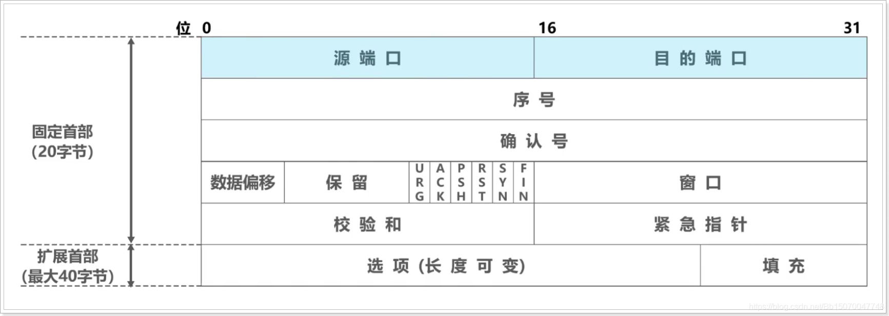
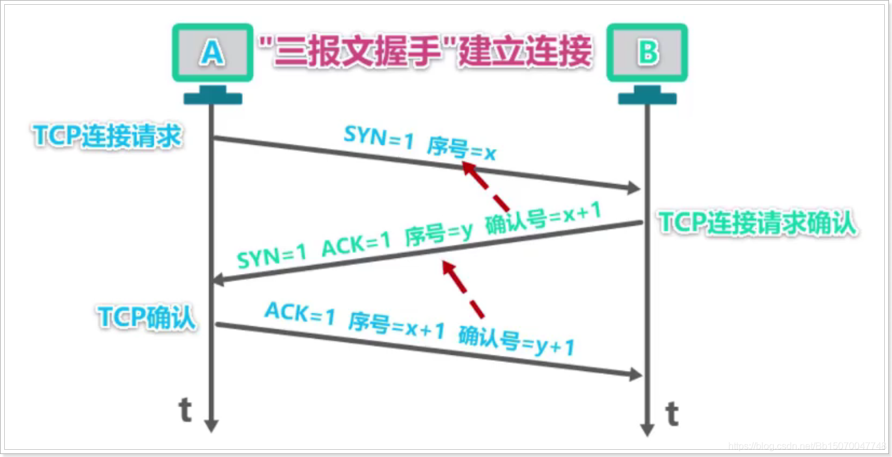
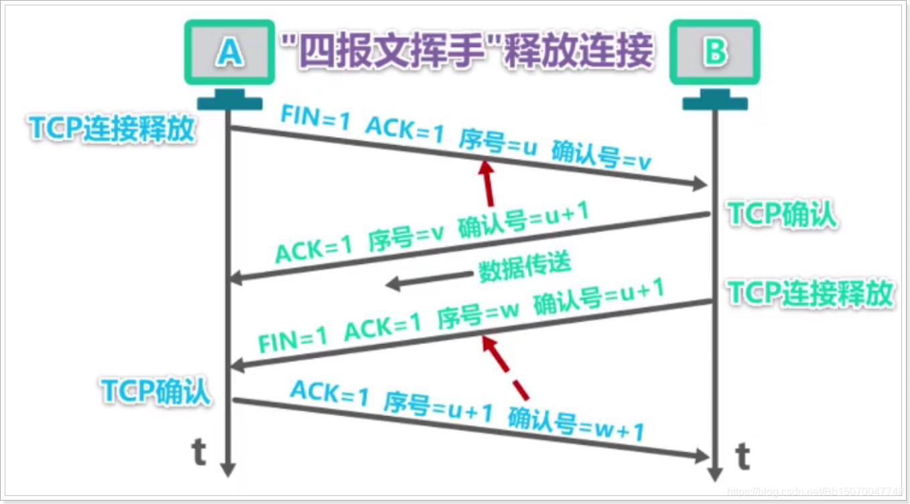

# TCP、UDP、网络通信

## 基于网络编程

### 网络编程概述

计算机网络是通过**传输介质**（网线）、**通信设施**（路由器、交换机等）和**网络通信**协议，把分散在不同地点的计算机设备互连起来的，用来实现数据共享。

网络编程就是编写程序使互联网的多个设备（如计算机）之间进行数据

### 网络分层

通过网络发送数据是一项复杂的操作，通过网络将数据从一台主机发送到另外的主机，这个过程是通过计算机网络通信来完成。

网络通信的不同方面被分解为多个层，层与层之间用接口连接。通信的双方具有相同的层次，层次实现的功能由协议数据单元来描述。不同系统中的同一层构成对等层，对等层之间通过对等层协议进行通信，理解批次定义好的规则和约定。将网络分层，这样就可以修改甚至替换某一层的软件，只要层与层之间的接口保持不变，就不会影响到其他层。

#### OSI参考模型

世界上第一个网络体系结构在1974年由IBM公司提出，名为SNA。以后其他公司也相继提出自己的网络体系结构。为了促进计算机网络的发展，国际标准化组织ISO在现有网络的基础上，提出了不基于具体机型、操作系统或公司的网络体系结构，称为开放系统互连参考模型，即OSI/RM（Open System Interconnection Reference Model）。

- **物理层**：为数据端设备提供原始比特流的传输的通路；网络通信的数据传输介质，由电缆与设备共同构成。常见：中继器，集线器（HUB）、网线、RJ-45标准等
- **数据链路层**：在通信的实体间建立数据链路连接；将数据分帧，并处理流控制、物理地址寻址、重发等。常见：网卡，网桥，二层交换机等
- **网络层**：为数据在结点之间传输创建逻辑链路，并分组转发数据；对子网间的数据包进行路由选择。常见：路由器、多层交换机、防火墙、IP、IPX、RIP、OSPF
- **传输层**：提供应用进程之间的逻辑通信；建立连接，处理数据包错误、数据包次序。常见：TCP、UDP、SPX、进程、端口(socket)
- **会话层**：建立端连接并提供访问验证和会话管理；为数据在结点之间传输创建逻辑链路，并分组转发数据；使用校验点可使会话在通信失效时从校验点恢复通信。常见：服务器验证用户登录、断点续传
- **表示层**：提供数据格式转换服务；解密与加密，图片解码和编码、数据的压缩和解压缩。常见：URL加密、口令加密、图片编解码
- **应用层**：访问网络服务的接口；为操作系统或网络应用程序提供访问网络服务的接口。常见：Telnet、FTP、 HTTP、 SNMP、DNS等

#### TCP/IP参考模型

TCP/IP，即Transmission Control Protocol/Internet Protocol的简写，中译名为传输控制协议/因特网互联协议，是Internet最基本的协议，Internet国际互联网络的基础。

TCP/IP协议是一个开放的网络协议簇，它的名字主要取自最重要的网络层IP协议和传输层TCP协议。TCP/IP协议定义了电子设备如何连入因特网，以及数据如何在它们之间传输的标准。TCP/IP参考模型采用4层的层级结构，每一层都呼叫它的下一层所提供的协议来完成自己的需求，这4个层次分别是：网络接口层、网络层（IP层）、传输层（TCP层）、应用层。

### 网络名词

#### IP地址

IP（Internet Protocol Address）：全称互联网协议地址，简称IP地址；IP地址用于标识互联网上的唯一一台机器，互联网就是通过IP地址锁定到我们的这台电脑，相当于家庭地址；

IP地址的分类

- IPv4：是一个32位的二进制数，通常被分为4个字节，表示成a.b.c.d 的形式，例如192.168.65.100 。其中a、b、c、d都是0~255之间的十进制整数，那么最多可以表示42亿个。
- IPv6：由于互联网的网民日益增多，IPv4的IP地址资源有限。为了扩大地址空间，拟通过IPv6重新定义地址空间，采用128位地址长度，每16个字节一组，分成8组十六进制数，表示成ABCD:EF01:2345:6789:ABCD:EF01:2345:6789，号称可以为全世界的每一粒沙子编上一个网址，这样就解决了网络地址资源数量不够的问题。

#### 端口号

在两台计算机通信时，更准确的来说是两台计算机的某个进程（应用程序）在通信，IP地址可以唯一标识网络中的设备，那么端口号就是唯一标识计算机中的某个应用程序了；

> tips：端口号的取值范围为065536。其中01023之间的端口号用于计算机内置的一些进程，我们自己的程序的端口号尽量设置在1023以上的端口，保证端口不会占用冲突；

### 网络协议

如同人与人之间相互交流是需要遵循一定的规则（如语言）一样，计算机之间能够进行相互通信是因为它们都共同遵守一定的规则，即网络协议。

#### UDP

UDP（User Datagram Protocol）：用户数据报协议；UDP是面向无连接的通信协议，即在数据传输时，数据的发送端和接收端不建立逻辑连接。简单来说，当一台计算机向另外一台计算机发送数据时，发送端不会确认接收端是否存在，就会发出数据，同样接收端在收到数据时，也不会向发送端反馈是否收到数据。

##### UDP传输过程

UDP是面向报文传递数据的；在UDP传输过程中，分别为发送端和接受端；

发送端使用UDP发送数据时，首先将其包裹成一个UDP报文（包含数据与首部格式）通过网络将其发送给接收端；接受端接收到UDP报文后，首先去掉其首部，将数据部分交给应用程序进行解析；

> 需要注意的是，UDP不保证数据传递的可靠性，在传递过程中可能出现丢包等情况，另外，即使接收方不存在报文依旧被发送出去（丢包）。但正是因为UDP不需要花费额外的资源来建立可靠的连接，因此UDP传输速度快，资源消耗小；

##### UDP报文格式

一个完整的UDP报文包含首部和载荷（数据）两部分，首部由 4 个 16 位（2 字节）长的字段，共8个字节组成，分别说明该报文的源端口、目的端口、报文长度和校验值。

UDP 报文中每个字段的含义如下：

- 源端口：发送端所使用应用程序的UDP端口，接受端的应用程序理由这个字段的值作为响应的目的地址；这个字段是可选的，所以发送端的应用程序不一定会把自己的端口号写入该字段中。如果不写入端口号，则把这个字段设置为 0。这样，接收端的应用程序就不能发送响应了。
- 目的端口：接收端计算机上 UDP 软件使用的端口。
- 长度：表示 UDP 数据报长度，单位：字节；包含 UDP 报文头+UDP 数据长度。因为 UDP 报文头长度是 8 个字节，所以这个值最小为 8。
- 校验值：可以检验数据在传输过程中是否被损坏。

##### UDP总结

由于使用UDP协议消耗资源小，通信效率高；因此一般用于实时性要求比较高的场合如：音频、视频的传输等；例如视频会议都使用UDP协议，如果出现了网络丢包情况也只是造成卡帧现象，对整体影响不大

但是在使用UDP协议传送数据时，由于UDP的面向无连接性，不能保证数据的完整性，因此在传输重要数据时不建议使用UDP协议。

#### TCP

TCP（Transmission Control Protocol）：传输控制协议；TCP协议是面向连接的通信协议；即传输数据之前，在发送端和接收端建立逻辑连接，然后再传输数据，它提供了两台计算机之间可靠无差错的数据传输。

在TCP连接中必须要明确客户端（发送端）与服务器端（接收端），由客户端向服务端发出连接请求，每次连接的创建都需要经过“三次握手”；

##### TCP报文格式

一个完整的TCP报文同样也是由首部和数据载荷组成；TCP的全部功能都体现在它首部中各字段的作用。

- **源端口**：占2个字节，16个比特；表示**发送该报文的应用程序端口号**，用于接收端的响应；
- **目的端口号**：占2个字节，16个比特；标识**接受该TCP报文的应用程序端口号**；
- **序号**：数据载荷中的数据都是有顺序的，序号用于标识发送端向接收端发送的数据字节流的位置；
- **确认号**：期望收到对方下一个TCP报文序号的起始位置，同时也是对之前收到的数据进行确认；
- **数据偏移**：占4个比特，用来指出数据载荷部分的起始处距离报文的起始处有多远；也就是TCP首部的长度。**需要注意的是数据偏移以4个字节为单位；**
- **保留字段**：占6个比特，保留为今后使用，但目前为0；

- **窗口**： 占2个字节，16个比特；用于流量控制和拥塞控制，表示当前接收缓冲区的大小。在计算机网络中，通常是用接收方的接收能力的大小来控制发送方的数据发送量。TCP连接的一端根据缓冲区大小确定自己的接收窗口值，告诉对方，使对方可以确定发送数据的字节数。

- **校验和**：占2个字节，16比特；检查报文的首部和数据载荷两部分，底层依赖于具体的校验算法；

- **紧急指针**：占2个字节，16比特；用来指明紧急数据的长度；当发送端有紧急数据时，可将紧急数据插队到发送缓存的最前面，并立刻封装到一个TCP报文段中进行发送。紧急指针会指出本报文段数据载荷部分包含了多长的紧急数据，紧急数据之后是普通数据

- **选项**：附加一些额外的首部信息；

- **填充**：由于选项的长度可变，因此用来填充的确认报文首部能被4整除（因为数据偏移字段，也就是首部长度字段，是以4字节为单位的）；

- **标志位**：

  - **ACK**(确认)：取值为1时确认号字段才有效；取值为0时确认号字段无效，一般情况下都为1；

  - **SYN**(同步)：在连接建立时用来同步序号

  - **FIN**(终止)：为1时表明发送端数据发送完毕要求释放连接

  - **RST**(复位)：用于复位TCP连接，值为1时说明连接出现了异常，必须释放连接，然后再重新建立连接，有时RST置1还用来拒绝一个非法的报文段或拒绝打开一个TCP连接；

  - **PSH**(推送)：为1时接收方应尽快将这个报文交给应用层，而不必等到接受缓存都填满后再向上交付

  - **URG**(紧急)：为1时表明紧急指针字段有效，取值为0时紧急字段无效；

##### 三次握手

由于TCP是基于可靠通信的，在发送数据之前必须建立可靠的连接；TCP建立连接的过程分为三个步骤，我们称为"三次握手"；

简单的过程如下图所示：

- 第一次握手：发送端向接收端端发出连接请求，等待接受的响应。
- 第二次握手，接收端向发送端响应，通知发送端收到了连接请求。
- 第三次握手，客户端再次向服务器端发送确认信息，确认连接。

我们结合TCP报文原理来具体分析一下三次握手的详细流程：

原理图如下：

1）第一次握手：首先A使用TCP连接向B发送报文（此报文不携带载荷，只有首部），报文中的SYN记为1（如果发送失败，重新发送记为2），序号记为x

2）第二次握手：B接受到A发送的报文后，给A发送一个确认报文（该报文也仅有首部），报文中SYN和ACK都取值为1，用于标志这是一个确认报文段；同时此次响应的序号记为y，确认号为上一次序号x加1的值，表示已经成功接收到x+1之前的所有内容，下一次开始接受x+1之后的数据（包含x+1的数据）；

3）第三次握手：A再次向B发送TCP确认，序号为x+1，代表发送序号x之后的数据；确认号为y+1，代表已经接收了来自B的响应的全部数据；

##### 四次挥手

TCP建立连接时需要"三次握手"，断开连接时则需要"四次挥手"；

原理图如下：

1）A向B发送连接释放请求，标记FIN=1（表示需要断开连接）；序号记为u（u为之前已发送的最后一个字节数据的序号+1），确认号记为v（v为之前已接受的最后一个字节数据的序号+1）
2）B收到A发送的断开连接请求后开始响应，标记序号为v，确认号为u+1（代表已经成功接收A发送的数据，接下来开始接受u+1及之后序号的数据）
3）主机B如果仍有数据需要传输依旧可以传输，如果B没有数据需要发送时，需给A发送连接释放报文。标记FIN=1，序号为w（同理，此时w是B之前已发送最后一个字节数的序号+1），确认号为u+1；
4）A接收到B发送的连接释放报文后，最终给B发送一个TCP确认报文，代表确定接受到B需要连接断开。序号为u+1，确认号为w+1（代表B发送的数据以及全部接受完毕）

##### TCP总结

使用TCP协议传输数据时，必须要建立可靠连接（三次握手），当连接关闭时还需要四次挥手，对性能损耗较大，如果频繁的创建和关闭TCP连接性能势必会有很大影响。但是由于TCP的可靠传输，对一些数据完整性要求较高的场合比较适用，如文件上传下载等；

## Java实现UDP应用程序

#### InetAddress类

`java.net.InteAddress`类是用于描述IP地址和域名的一个Java类；

常用方法如下：

- `public static InetAddress getByName(String host)`：根据主机名获取InetAddress对象
- `public String getHostName()`：获取该对象对应的主机名
- `public String getHostAddress()`获取该对象对应的IP地址

#### DatagramPacket类

`java.net.DatagramPacket`类用于封装一个UDP数据报文

##### 构造方法

- `public DatagramPacket(byte[] buf, int length, InetAddress address, int port)`：创建一个数据包对象

  - `buf`：要发送的内容

  - `length`：要发送的内容⻓度，单位字节

  - `address`：接收端的ip地址

  - `port`：接收端⼝号

- `public DatagramPacket(byte buf[], int length)`：创建一个数据包对象

##### 常用方法

- `public synchronized int getLength()：`获取此UDP数据包载荷的数据长度（单位字节）

- `public synchronized int getPort()：`获取此UDP数据包的目的端口号
- `public synchronized byte[] getData()` ：获取此UDP数据包的载荷部分（数据）

#### DatagramSocket类

`java.net.DatagramSocket`类用于描述一个UDP发送端或接收端；

##### 构造方法

- `public DatagramSocket(int port)`：通过端口构建一个发送端/接收端

##### 常用方法

- `public void send(DatagramPacket p)`：发送一个UDP数据包
- `public synchronized void receive(DatagramPacket p)`：接收一个UDP数据包
- `public void close()`：释放该Socket占用的资源

## Java实现TCP程序

在TCP通信中，分为数据的发送端（客户端）和接收端（服务器），当建立连接成功后（三次握手），才可以进行数据的发送；

在Java中，提供了两个类用于实现TCP通信程序：

- 客户端：`java.net.Socket` 类表示；用于与服务器端建立连接，向服务器端发送数据报文等；

- 服务端：`java.net.ServerSocket` 类表示；用于与客户端的交互；

### Socket

`java.net.Sokcet`用于封装一个TCP应用程序的客户端；

#### 构造方法

- `public Socket(String host, int port)` ：创建套接字对象并将其连接到指定主机上的指定端口号。**如果指定的host是null** ，则相当于指定地址为本机地址。

#### 成员方法

- `public InputStream getInputStream()` ： 返回此套接字的输入流。关闭生成的InputStream也将关闭相关的Socket。

- `public OutputStream getOutputStream()` ： 返回此套接字的输出流。关闭生成的OutputStream也将关闭相关的Socket。

- `public void close()` ：关闭此套接字。关闭此socket也将关闭相关的InputStream和OutputStream 。

- `public void shutdownOutput()` ： 禁用此套接字的输出流。任何先前写出的数据将被发送，随后终止输出流。

  

### ServerSocket

`ServerSocket`类：这个类实现了服务器套接字，该对象等待通过网络的请求。

#### 构造方法

- `public ServerSocket(int port)` ：使用该构造方法在创建ServerSocket对象时，就可以将其绑定到一个指定的端口号上，参数port就是端口号。

#### 成员方法

- `public Socket accept()` ：监听并接受连接，返回一个新的Socket对象，用于和客户端实现通信。该方法会一直阻塞直到建立连接。