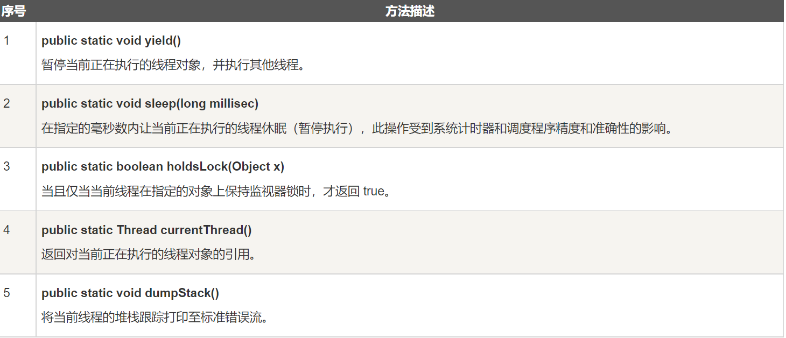

# 多线程编程

## 程序的并发与并行

#### 程序的并行

程序的并行指的是多个应用程序**真正意义上的同时执行**，CPU分配多个执行单元共同执行这些任务，效率高，但这依赖于CPU的硬件支持，需要CPU多核心的支持，单核处理器的CPU是不能并行的处理多个任务的。

#### 程序的并发

程序的并发指的是多个应用程序**交替执行**，CPU分配给每个应用程序一些“执行时间片”用于执行该应用程序，由于CPU的处理速度极快，并且分配个每个线程的“执行时间片”极短，给人们造成视觉上的误感，让人们以为是“同时”执行，其实是交替执行。

需要注意的是：虽然是交替执行，但是程序的并发解决了多个程序之间不能“同时”执行的问题，并且程序的并发利用了CPU的空余时间，能将CPU的性能较好的发挥，另外并发不受CPU硬件的限制，实际开发中，并发往往使我们考虑的重点。

> tips：程序并行执行需要依赖于CPU的硬件支持，而并发却不需要；


## 进程与线程

#### 进程的定义：

是指一个内存中运行的应用程序，我们开启的应用如QQ、微信、google浏览器、idea开发工具等都是一个应用，一个应用最少具备一个进程，也有可能有多个进程，每个进程都有一个独立的内存空间，**进程是系统运行程序的基本单位；**

> 多个进程的执行可以是并行也可以是并发；

#### 线程的定义：

线程是进程中的一个执行单元，负责当前进程中程序的执行，是一个程序内部的一条执行路径，一个进程中至少有一个线程。一个进程中是可以有多个线程的，这个应用程序也可以称之为多线程程序；


## Java中的多线程

Java使用`java.lang.Thread`类代表线程，所有的线程对象都必须是`Thread`类或其子类的实例。每个线程的作用是完成一定的任务，实际上就是执行一段程序代码。

继承Thread类都将变为线程类，调用`Thread`类中的`start`()方法即开启线程；当线程开启后，将会执行`Thread`类中的`run`方法，因此我们要做的就是重写Thread中的run方法，将线程要执行的任务由我们自己定义；


#### 一个线程的生命周期


- 新建状态:

  使用 **new** 关键字和 **Thread** 类或其子类建立一个线程对象后，该线程对象就处于新建状态。它保持这个状态直到程序 **start()** 这个线程。

- 就绪状态:

  当线程对象调用了start()方法之后，该线程就进入就绪状态。就绪状态的线程处于就绪队列中，要等待JVM里线程调度器的调度。

- 运行状态:

  如果就绪状态的线程获取 CPU 资源，就可以执行 **run()**，此时线程便处于运行状态。处于运行状态的线程最为复杂，它可以变为阻塞状态、就绪状态和死亡状态。

- 阻塞状态:

  如果一个线程执行了sleep（睡眠）、suspend（挂起）等方法，失去所占用资源之后，该线程就从运行状态进入阻塞状态。在睡眠时间已到或获得设备资源后可以重新进入就绪状态。可以分为三种：

  - 等待阻塞：运行状态中的线程执行 wait() 方法，使线程进入到等待阻塞状态。
  - 同步阻塞：线程在获取 synchronized 同步锁失败(因为同步锁被其他线程占用)。
  - 其他阻塞：通过调用线程的 sleep() 或 join() 发出了 I/O 请求时，线程就会进入到阻塞状态。当sleep() 状态超时，join() 等待线程终止或超时，或者 I/O 处理完毕，线程重新转入就绪状态。

- 死亡状态:

  一个运行状态的线程完成任务或者其他终止条件发生时，该线程就切换到终止状态。

> 需要注意的是：当开启一个新线程之后（start方法被调用），JVM会在栈内存中开辟一块新的内存空间，每个线程都有自己独立的栈空间，进行方法的弹栈和压栈。**线程和线程之间栈内存独立，堆内存和方法区内存共享。一个线程一个栈。**


#### 线程的创建

Java 提供了三种创建线程的方法：

- 通过实现 Runnable 接口；
- 通过继承 Thread 类本身；
- 通过 Callable 和 Future 创建线程。

#### 停止线程

- 不推荐使用JDK提供的stop()、destroy()方法

- 推荐线程自己停止下来

- 建议使用一个标志位进行终止变量当flag=false，则终止线程运行

- ```java
  public class TestStop implements Runable{
      //线程中定义线程使用的标识
      private boolean flag = true;
      
      @Override
      public void run(){
          //线程体使用该标识
          while(flag){
              System.out.println("run Thread");
          }
      }
      
      //对外提供方法改变标识
      public void stop(){
          this.flag = false;
      }
  }
  ```


## 线程类

#### 通过继承Thread来创建线程

创建一个线程的第二种方法是创建一个新的类，该类继承 `Thread` 类，然后创建一个该类的实例。继承类必须重写 `run`() 方法，该方法是新线程的入口点。它也必须调用 `start`() 方法才能执行。该方法尽管被列为一种多线程实现方式，但是本质上也是实现了 `Runnable` 接口的一个实例。

> 例子
>
> ```java
> class ThreadDemo extends Thread {
> private Thread t;
> private String threadName;
> 
> ThreadDemo( String name) {
>    threadName = name;
>    System.out.println("Creating " +  threadName );
> }
> 
> public void run() {
>    System.out.println("Running " +  threadName );
>    try {
>       for(int i = 4; i > 0; i--) {
>          System.out.println("Thread: " + threadName + ", " + i);
>          // 让线程睡眠一会
>          Thread.sleep(50);
>       }
>    }catch (InterruptedException e) {
>       System.out.println("Thread " +  threadName + " interrupted.");
>    }
>    System.out.println("Thread " +  threadName + " exiting.");
> }
> 
> public void start () {
>    System.out.println("Starting " +  threadName );
>    if (t == null) {
>       t = new Thread (this, threadName);
>       t.start ();
>    }
> }
> }
> 
> public class TestThread {
> 
> public static void main(String args[]) {
>    ThreadDemo T1 = new ThreadDemo( "Thread-1");
>    T1.start();
> 
>    ThreadDemo T2 = new ThreadDemo( "Thread-2");
>    T2.start();
> }   
> }
> ```

#### Thread对象方法

#### Thread静态方法



#### 


#### 通过实现 Runnable 接口来创建线程

创建一个线程，最简单的方法是创建一个实现 Runnable 接口的类。

为了实现 Runnable，一个类只需要执行一个方法调用 run()，声明如下：

你可以重写该方法，重要的是理解的 run() 可以调用其他方法，使用其他类，并声明变量，就像主线程一样。

在创建一个实现 Runnable 接口的类之后，你可以在类中实例化一个线程对象。

Thread 定义了几个构造方法，下面的这个是我们经常使用的：

Thread(Runnable threadOb,String threadName);

> 例子
>
> ```java
> class RunnableDemo implements Runnable {
>    private Thread t;
>    private String threadName;
>    
>    RunnableDemo( String name) {
>       threadName = name;
>       System.out.println("Creating " +  threadName );
>    }
>    
>    public void run() {
>       System.out.println("Running " +  threadName );
>       try {
>          for(int i = 4; i > 0; i--) {
>             System.out.println("Thread: " + threadName + ", " + i);
>             // 让线程睡眠一会
>             Thread.sleep(50);
>          }
>       }catch (InterruptedException e) {
>          System.out.println("Thread " +  threadName + " interrupted.");
>       }
>       System.out.println("Thread " +  threadName + " exiting.");
>    }
>    
>    public void start () {
>       System.out.println("Starting " +  threadName );
>       if (t == null) {
>          t = new Thread (this, threadName);
>          t.start ();
>       }
>    }
> }
>  
> public class TestThread {
>  
>    public static void main(String args[]) {
>       RunnableDemo R1 = new RunnableDemo( "Thread-1");
>       R1.start();
>       
>       RunnableDemo R2 = new RunnableDemo( "Thread-2");
>       R2.start();
>    }   
> }
> ```

#### Thread和Runnable的区别

如果一个类继承Thread，则不适合资源共享。但是如果实现了Runable接口的话，则很容易的实现资源共享。

总结：

实现Runnable接口比继承Thread类所具有的优势：

- 适合多个相同的程序代码的线程去共享同一个资源。
- 可以避免java中的单继承的局限性。
- 增加程序的健壮性，实现解耦操作，代码可以被多个线程共享，代码和线程独立。
- 线程池只能放入实现Runable或Callable类线程，不能直接放入继承Thread的类。


> 扩充：在Java中，每次程序运行至少启动2个线程。一个是main线程，一个是垃圾收集线程。因为每当使用Java命令执行一个类的时候，实际上都会启动一个JVM，每一个JVM其实在就是在操作系统中启动了一个进程。

#### 通过Callable和Future创建线程

- 创建 Callable 接口的实现类，并实现 call() 方法，该 call() 方法将作为线程执行体，并且有返回值。
- 创建 Callable 实现类的实例，使用 FutureTask 类来包装 Callable 对象，该 FutureTask 对象封装了该 Callable 对象的 call() 方法的返回值。
- 使用 FutureTask 对象作为 Thread 对象的 target 创建并启动新线程。
- 调用 FutureTask 对象的 get() 方法来获得子线程执行结束后的返回值。

> 例子
>
> ```java
> public class CallableThreadTest implements Callable<Integer> {
>     public static void main(String[] args)  
>     {  
>         CallableThreadTest ctt = new CallableThreadTest();  
>         FutureTask<Integer> ft = new FutureTask<>(ctt);  
>         for(int i = 0;i < 100;i++)  
>         {  
>             System.out.println(Thread.currentThread().getName()+" 的循环变量i的值"+i);  
>             if(i==20)  
>             {  
>                 new Thread(ft,"有返回值的线程").start();  
>             }  
>         }  
>         try  
>         {  
>             System.out.println("子线程的返回值："+ft.get());  
>         } catch (InterruptedException e)  
>         {  
>             e.printStackTrace();  
>         } catch (ExecutionException e)  
>         {  
>             e.printStackTrace();  
>         }  
>   
>     }
>     @Override  
>     public Integer call() throws Exception  
>     {  
>         int i = 0;  
>         for(;i<100;i++)  
>         {  
>             System.out.println(Thread.currentThread().getName()+" "+i);  
>         }  
>         return i;  
>     }  
> }
> ```

#### 创建线程的三种方式的对比

-  采用实现 Runnable、Callable 接口的方式创建多线程时，线程类只是实现了 Runnable 接口或 Callable 接口，还可以继承其他类。
-  使用继承 Thread 类的方式创建多线程时，编写简单，如果需要访问当前线程，则无需使用 Thread.currentThread() 方法，直接使用 this 即可获得当前线程。
-  Thread与Runnable比较，更推荐使用Runnable接口，避免了单继承的局限性，灵活方便，方便同一个对象被多个线程使用


## 线程的操作

#### 线程的休眠

- `public static void sleep(long millis)`：让当前线程睡眠指定的毫秒数

#### 线程的加入

多条线程时，当指定线程调用join方法时，线程执行权交给该线程，并且当前线程必须等该线程执行完毕之后才会执行但有可能被其他线程抢去CPU执行权.

- `public final void join()：`让线程在当前线程优先执行,直至t线程执行完毕时,再执行当前线程.
- `public final void join(long millis)`：让线程执行millis毫秒，然后将线程执行器抛出，给其他线程争抢

#### 守护线程

当用户线程（非守护线程）行完毕时，守护线程也会停止执行但由于CPU运行速度太快，当用户线程执行完毕时，将信息传递给守护线程，会有点时间差，而这些时间差会导致还会执行一点守护线程；

> 需要注意的是：不管开启多少个线程（用户线程），守护线程总是随着第一个用户线程的停止而停止
>
> ```java
> public final void setDaemon(boolean on)：设置线程是否为守护线程
> ```

#### 线程的优先级

每一个 `Java` 线程都有一个优先级，这样有助于操作系统确定线程的调度顺序。

Java 线程的优先级是一个整数，其取值范围是 1 （Thread. MIN_PRIORITY ） - 10 （Thread. MAX_PRIORITY ）。

默认情况下，每一个线程都会分配一个优先级 NORM_PRIORITY（5）。

具有较高优先级的线程对程序更重要，并且应该在低优先级的线程之前分配处理器资源。但是，线程优先级不能保证线程执行的顺序，而且非常依赖于平台。

> `public final void setPriority(int newPriority)`：设置线程的优先级。

#### 线程礼让

在多线程执行时，线程礼让，告知当前线程可以将执行权礼让给其他线程，礼让给优先级相对高一点的线程，但**仅仅是一种告知，并不是强制将执行权转让给其他线程，当前线程将CPU执行权礼让出去后，也有可能下次的执行权还在原线程这里；**如果想让原线程强制让出执行权，可以使用join()方法

> public static void yield()：将当前线程的CPU执行权礼让出来；
>


#### 多线程的使用

有效利用多线程的关键是理解程序是并发执行而不是串行执行的。例如：程序中有两个子系统需要并发执行，这时候就需要利用多线程编程。

通过对多线程的使用，可以编写出非常高效的程序。不过请注意，如果你创建太多的线程，程序执行的效率实际上是降低了，而不是提升了。

请记住，上下文的切换开销也很重要，如果你创建了太多的线程，CPU 花费在上下文的切换的时间将多于执行程序的时间！


