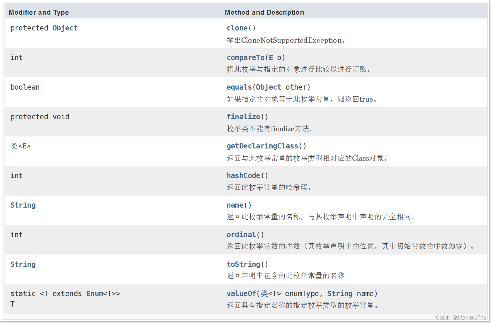

# 枚举、类加载器、动态代理

## 枚举

### 枚举概述

枚举（enum），全称`enumeration`，是JDK 1.5 中引入的新特性。Java 枚举是一个特殊的类，一般表示一组常量，比如一年的 4 个季节，一个年的 12 个月份，一个星期的 7 天，方向有东南西北等。

在JDK1.5 之前，我们定义常量都是： `public static fianl`。有了枚举之后，可以把相关的常量分组到一个枚举类型里，而且枚举提供了比常量更多的方法。


### 定义枚举类型

Java枚举类使用`enum`关键字来定义，各个常量使用逗号来分割

> Tips：定义枚举类的关键字是**enum**，而不是**Enum**，在Java中所有**关键字**都是小写的！

案例：

```java
package com.dfbz.demo02;

public enum Season {
    SPRING,SUMMER,AUTUMN,WINTER
}
```

其中`SPRING`、`SUMMER`、`AUTUMN`、`WINTER`都是**枚举项**，**它们都是本类的实例，本类一共就只有四个实例对象。并且只能通过这四个关键字获取Season类的示例对象，不能使用new来创建枚举类的对象**


#### 枚举与switch

```java
package com.dfbz.demo02;

import org.junit.Test;

/**
 * @author lscl
 * @version 1.0
 * @intro:
 */
public class Demo01 {

    @Test
    public void test1() {
        Season season = Season.AUTUMN;

        switch (season){
            case SPRING:
                System.out.println("春天~");
                break;
            case SUMMER:
                System.out.println("夏天！");
                break;
            case AUTUMN:
                System.out.println("秋天@");
                break;
            case WINTER:
                System.out.println("冬天&");
                break;
            default:
                System.out.println("错误的季节");
        }
    }
}
```


### 枚举的用法

#### 枚举类的成员

枚举类和正常的类一样，可以有实例变量，实例方法，静态方法等等

```java
package com.dfbz.demo03;

/**
 * @author lscl
 * @version 1.0
 * @intro:
 */
public enum Color {
    
    // 在枚举常量后面还有其他成员时，分号是必须的。枚举常量必须在枚举类中所有成员的上方声明
    RED, GREEN, BLUE;

    public String aaa = "AAA";              // 普通成员变量

    public static String bbb = "BBB";       // 静态成员变量

    private String name;

    public String getName() {
        return name;
    }

    public void setName(String name) {
        this.name = name;
    }

    public static void method() {
        System.out.println("enum hello~");
    }
}

```

#### 枚举类的构造方法

##### 枚举的无参构造方法

枚举类也可以有构造方法，**构造方法默认都是private修饰，而且只能是private**。因为枚举类的实例不能让外界来创建！

> Tips：
>
> - 1：当枚举项后面有其他成员（构造方法、成员变量、成员方法）时，最后一个枚举项必须加分号；
> - 2：所有的枚举类的构造方法都是私有的（private关键字可加可不加
>
> Tips：一旦创建了枚举实例，便会初始化里面的所有枚举项；创建枚举项就等同于调用本类的无参构造器，所以FRONT、BEHIND、LEFT、RIGHT四个枚举项等同于调用了四次无参构造器

##### 枚举的有参构造方法

**枚举项就是枚举类的实例，在创建定义枚举项时其实就是创建枚举类的实例，因此在定义枚举项就要传递实际的参数**

#### 枚举中的抽象方法

枚举类中可以包含抽象方法，**但是在定义枚举项时必须重写该枚举类中的所有抽象方法；**

我们前面说过，每一个枚举项其实都是枚举类的实例对象，因此如果当前枚举类包含抽象方法时，在定义枚举项时就需要重写此枚举类的所有抽象方法，这跟我们以前使用的匿名内部类很相似；

### Enum类

#### Enum类中的方法

Java中，所有的枚举类都默认继承与`java.lang.Enum`类，这说明Enum中的方法所有枚举类都拥有。另外Enum也继承与Object，因此所有的枚举类都拥有与Object类一样的方法



> Tips：枚举类除了不能拥有Object中的clone、finalize方法外，其他方法都能拥有；

Enum类新增（或重写Object）的方法：

- `int compareTo(E e)`：比较两个枚举常量谁大谁小，其实比较的就是枚举常量在枚举类中声明的顺序（ordinal值）
- `boolean equals(Object o)`：比较两个枚举常量是否相等；
- `Class<E> getDeclaringClass()`：返回此枚举类的Class对象，这与Object中的getClass()类似；
- `int hashCode()`：返回枚举常量的`hashCode`；
- `String name()`：返回枚举常量的名字；
- `int ordinal()`：返回枚举常量在枚举类中声明的序号，第一个枚举常量序号为0；
- `String toString()`：把枚举常量转换成字符串；
- `static T valueOf(Class enumType, String name)`：把字符串转换成枚举常量。

#### 枚举的两个抽象方法

每个枚举类都有两个静态方法，而且这两个方法不是父类中的方法。这又是枚举类特殊的地方；

- `static T[] values()`：返回本类所有枚举项；
- `static T valueOf(String name)`：通过枚举项的名字返回枚举项；


## 类加载器

### 类加载时机

我们知道，所有的代码都是运行在内存中的，我们必须把类加载到内存中才能运行；在Java中，所有的Java类都是通过类加载器加载到内存进行执行的；

一个类何时被加载？

- 创建该类对象时，首先会将内加载到内存（如果该类存在父类，那么首先加载父类到内存，创建父类的对象（super））
- 访问该类的静态成员时，会将类加载到内容
- class.forName(“类的全包名”)

> Tips：**不管是用什么方法加载，类从始至终只会加载一次；**

### 类加载器

#### 类加载器的种类

- **启动类加载器Bootstrap ClassLoader**： 是嵌在JVM内核中的加载器，该加载器是用C++语言写的，主要负则加载JAVA_HOME/lib下的类库，启动类加载器无法被应用程序直接使用。
- **扩展类加载器Extension ClassLoader：** 该加载器器是用JAVA编写，且它的父类加载器是Bootstrap，是由sun.misc.Launcher$ExtClassLoader实现的，主要加载JAVA_HOME/lib/ext目录中的类库。开发者可以这几使用扩展类加载器。
- **系统类加载器App ClassLoader：** 系统类加载器，也称为应用程序类加载器，负责加载应用程序classpath目录下的所有jar和class文件（第三方jar）。它的父加载器为Ext ClassLoader。

#### 双亲委派机制

从JDK1.2开始，类的加载过程采用双亲委派机制，它是一种任务委派模式。即把加载类的请求交由父加载器处理，一直到顶层的父加载器（BootstrapClassLoader）；如果父加载器能加载则用父加载器加载，否则才用子加载器加载该类；

#### 双亲委派的好处

我们已经了解了Java中类加载的双亲委派机制，即加载类时交给父加载器加载，如果不能加载，再交给子加载器加载；这样做有何好处呢？

- 1）**避免类的重复加载**：当父类加载器已经加载了该类时，就没有必要子 ClassLoader 再加载一次。
- 2）**安全问题**：有了双亲委派机制，当有人想要替换系统级别的类时，在双亲委派机制下，系统类都已经被BootstrapClassLoader加载过了，而当一个类需要被加载时必定会轮到BootstrapClassLoader来加载（只是是否能加载的问题）；

#### URLClassLoader类加载器

在 java.net 包中，JDK提供了一个更加易用的类加载器URLClassLoader，它扩展了 ClassLoader，能够从本地或者网络上指定的位置加载类，我们可以使用该类作为自定义的类加载器使用。

URLClassLoader的构造方法：

- `public URLClassLoader(URL[] urls)`：指定要加载的类所在的URL地址，父类加载器默认为系统类加载器
- `public URLClassLoader(URL[] urls, ClassLoader parent)`：指定要加载的类所在的URL地址，并指定父类加载器。

#### 自定义类加载器

我们如果需要自定义类加载器，只需要继承ClassLoader，并覆盖掉findClass方法即可。

#### 打破双亲委派

根据我们之前学习双亲委派机制，上面两个类加载器在加载Show类时，都会判断有没有加载这个类，没有加载则使用父加载器加载，MyClassLoader的父加载器是AppClassLoader，而AppClassLoader正好可以加载这个类；所以其实这两次的加载都是由AppClassLoader来加载的，而AppClassLoader在加载时会判断是否已经加载过，加载过了则不加载；因此Show类只会加载一次；

但是需要注意的是，双亲委派机制的逻辑是写在ClassLoader类的loadClass方法中的，通过一系列逻辑判断最终执行findClass方法来加载类；如果我们加载类直接使用findClass方法呢？那就相当于避开了双亲委派；（当然也可以重写loadClass方法，重新自定义loadClass规则）


### 类的加载过程

#### 类的生命周期

一个Java类从开始到结束整个生命周期会经历7个阶段：加载（Loading）、验证（Verification）、准备（Preparation）、解析（Resolution）、初始化（Initialization）、使用（Using）和卸载（Unloading）。

其中验证、准备、解析三个部分又统称为连接（Linking）。

##### 加载

加载过程就是把class字节码文件载入到虚拟机中，至于从哪儿加载，虚拟机设计者并没有限定，你可以从文件、压缩包、网络、数据库等等地方加载class字节码。

- 通过类的全限定名来获取定义此类的二进制字节流
- 将此二进制字节流所代表的静态存储结构转化成方法区的运行时数据结构
- 在内存中生成代表此类的java.lang.Class对象，作为该类访问入口；

##### 连接

- 验证：连接阶段的开始，并不一定等到加载阶段结束。加载阶段与连接阶段的部分内容(如一部分字节码文件格式验证动作)是交叉进行的，加载阶段尚未完成，连接阶段可能已经开始，但这些夹杂在加载阶段之中的动作任然属于连接阶段，加载和连接这两个阶段的开始顺序是固定的。

- 准备：准备阶段会为类变量(被static修饰的变量)分配内存并设置类变量的初始值，这些变量所使用的内存都将在方法区中分配。假如有一个变量private static int value = 123;那么value在准备阶段过后值是0，而不是123；因为这个时候尚未执行任何java方法，而把value赋值为123的动作在初始化阶段才会执行。

  但是如果上面的变量被final修饰，变为：`private static final int value = 123;`编译时javac会为value生成ConstantValue属性，在准备阶段虚拟机就会根据ConstantValue的设置将value赋值为123。

- 解析：解析阶段是虚拟机将常量池内的符号引用替换为直接引用的过程。

> Tips：
>
> 符号引用：符号引用以一组符号来描述所引用的目标。符号引用可以是任何形式的字面量，只要使用时能无歧义地定位到目标即可，符号引用和虚拟机的布局无关。个人理解为：在编译的时候每个java类都会被编译成一个class文件，但在编译的时候虚拟机并不知道所引用类的地址，所以就用符号引用来代替，而在这个解析阶段就是为了把这个符号引用转化成为真正的地址的阶段。
> 直接引用：直接引用可以直接指向目标的指针、相对偏移量或是一个能间接定位到目标的句柄。直接引用是和虚拟机实现的布局内存有关，同一个符号引用在不同虚拟机示例上翻译出来的直接引用一般不同。如果有了直接引用，那引用的目标必定已经在内存中存在。

解析动作主要针对类或接口、字段、类方法、接口方法、方法类型方法句柄和调用点限定符7类符号引用进行。

##### 初始化

类初始化是类加载过程的最后一步，这一步会真正开始执行类中定义的Java程序代码(或者说字节码)。
在准备阶段，变量已经被赋过一次系统要求的初始值，在初始化阶段，变量会再次赋值为程序员设置的值。比如变量：private static int value = 123;那么value在准备阶段过后值是0，初始化阶段后值是123。


## 动态代理

### 什么是动态代理

动态代理的主要功能是在不修改源码的情况下对原有对象进行动态的代理，对原有对象的方法进行增强最终返回一个代理对象，此代理对象包含对象原有的功能和自己另加的功能

### 动态代理类相应的API：

- Proxy类

  | **static Object newProxyInstance(ClassLoader loader, Class[] interfaces, InvocationHandler h) 作用：生成一个代理对象** |                                                              |
  | :----------------------------------------------------------: | :----------------------------------------------------------: |
  |                          **loader**                          |                 **和目标对象一类的类加载器**                 |
  |                        **interfaces**                        |                  **目标对象所有实现的接口**                  |
  |                            **h**                             | **是一个接口，传一个匿名内部类做为实现类，并且重写其中的方法来实现代理的功能** |
  |                          **返回值**                          |                       **返回代理对象**                       |

- InvocationHandler接口

  | **Object invoke(Object proxy, Method method, Object[] args) 作用：这个接口中的方法会调用多次，每个方法都会调用一次，用来实现代理方法的功能** |                                                              |
  | :----------------------------------------------------------: | :----------------------------------------------------------: |
  |                          **proxy**                           | **代表生成的代理对象，不建议在方法中直接调用，不然会出现递归调用。** |
  |                          **method**                          |                      **代理的方法对象**                      |
  |                           **args**                           |                 **调用方法时传递的参数数组**                 |
  |                           **返回**                           |               **返回当前这个方法调用的返回值**               |

  