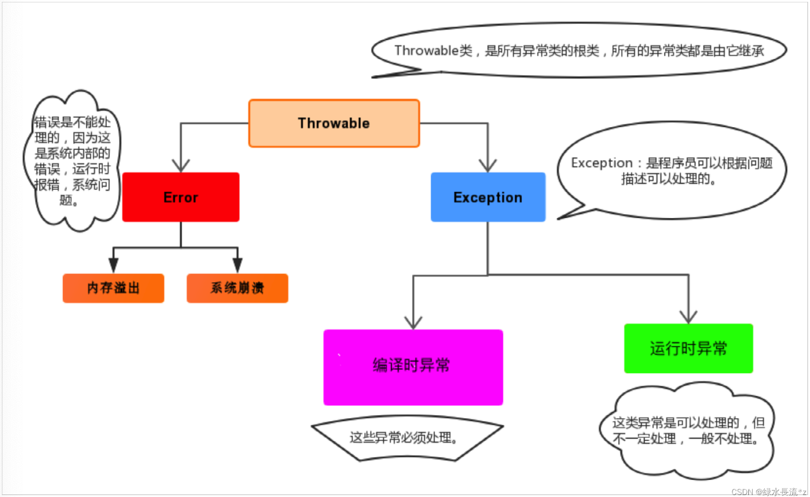

# 异常

### 异常概述

程序运行过程中出现的问题在Java中被称为异常，异常本身也是一个Java类，封装着异常信息；我们可以通过异常信息来快速定位问题所在；我们也可以针对性的定制异常，如用户找不到异常、密码错误异常、页面找不到异常、支付失败异常、文件找不到异常等等…

当程序出现异常时，我们可以提取异常信息，然后进行封装优化等操作，提示用户；

> 注意：语法错误并不是异常，语法错了编译都不能通过（但Java有提供编译时异常），不会生成字节码文件，根本不能运行；


#### 异常体系

Java程序运行过程中所发生的异常事件可分为两类：

- **Error**：表示严重错误，一般是JVM系统内部错误、资源耗尽等严重情况，无法通过代码来处理；
- **Exception**：表示异常，一般是由于编程不当导致的问题，可以通过Java代码来处理，使得程序依旧正常运行；

> Tips：我们平常说的异常指的就是Exception；因为Exception可以通过代码来控制，而Error一般是系统内部问题，代码处理不了；

#### 异常分类



异常的分类是根据是在编译器检查异常还是在运行时检查异常；

- **编译时期异常**：在编译时期就会检查该异常，如果没有处理异常，则编译失败；
- **运行时期异常**：在运行时才出发异常，编译时不检测异常；

> Tips：在Java中如果一个类直接继承与Exception，那么这个异常将是编译时异常；如果继承与RuntimeException，那么这个类是运行时异常。即使RuntimeException也继承与Exception；


### 异常的处理

Java程序的执行过程中如出现异常，会自动生成一个异常类对象，该异常对象将被提交给Java运行时系统（JVM），这个过程称为抛出(throw)异常。

> 如果一个方法内抛出异常，该异常会被抛到调用方法中。如果异常没有在调用方法中处理，它继续被抛给这个调用方法的调用者。这个过程将一直继续下去，直到异常被处理。这一过程称为捕获(catch)异常。如果一个异常回到main()方法，并且main()也不处理，则程序运行终止。
>

#### 异常的捕获

异常的捕获和处理需要采用 `try` 和 `catch` 来处理，具体格式如下：

- `try...catch(){}`：
- `try...catch(){}...finally{}`：
- `try...finally{}`：

> Tips：
>
> - 后处理的异常必须是前面处理异常的父类异常；
> - 如果finally有return语句，则永远返回finally中的结果。我们在开发过程中应该避免该情况；

#### 异常的常用方法

在`Throwable`类中具备如下几个常用异常信息提示方法：

- `public void printStackTrace()：`获取异常的追踪信息；

	包含了异常的类型,异常的原因,还包括异常出现的位置,**在开发和调试阶段,都得使用printStackTrace。**

- `public String getMessage()`：异常的错误信息；

异常触发被抓捕时，异常的错误信息都被封装到了catch代码块中的Exception类中了，我可以通过该对象获取异常错误信息；

#### 异常的抛出

我们已经学习过出现异常该怎么抓捕了，有时候异常就当做提示信息一样，在调用者调用某个方法出现异常后及时针对性的进行处理，目前为止异常都是由JVM自行抛出，当然我们可以选择性的自己手动抛出某个异常；

Java提供了一个throw关键字，它用来抛出一个指定的异常对象；抛给上一级；

> Tips：自己抛出的异常和JVM抛出的异常是一样的效果，都要进行处理，如果是自身抛出的异常一直未处理，最终抛给JVM时程序一样会终止执行；

#### 声明异常

**运行时异常**

在定义方法时，可以在方法上声明异常，用于提示调用者；

Java提供throws关键字来声明异常；关键字**throws**运用于方法声明之上，用于表示当前方法不处理异常，而是提醒该方法的调用者来处理异常(抛出异常)；

语法格式

```java
... 方法名(参数) throws 异常类名1,异常类名2…{   }		
```

**编译时异常**

在声明和抛出异常时需要注意如下几点：

1）如果是抛出（throw）编译时异常，那么必须要处理，可以选择在方法上声明，或者try…catch处理
2）如果调用的方法上声明（throws）了编译时异常，那么在调用方法时就一定要处理这个异常，可以选择继续往上抛，也可以选择try…catch处理

### 自定义异常

我们说了Java中不同的异常类，分别表示着某一种具体的异常情况，那么在开发中总是有些异常情况是Java中没有定义好的，此时我们根据自己业务的异常情况来定义异常类。

我们前面提到过异常分类编译时异常和运行时异常：

- 继承于`java.lang.Exception`的类为编译时异常，编译时必须处理；

- 继承于`java.lang.RuntimeException`的类为运行时异常，编译时可不处理；


### 方法的重写与异常

- 子类在重写方法时，父类方法没有声明编译时异常，则子类方法也不能声明编译时异常；

> 需要注意的是：运行时异常没有这个规定；也就是子类在重写父类方法时，不管父类方法是否有声明异常，子类方法都可以声明异常；

- 同样是在编译时异常中，在子类重写父类方法时，子类不可以声明比父类方法大的异常；

	