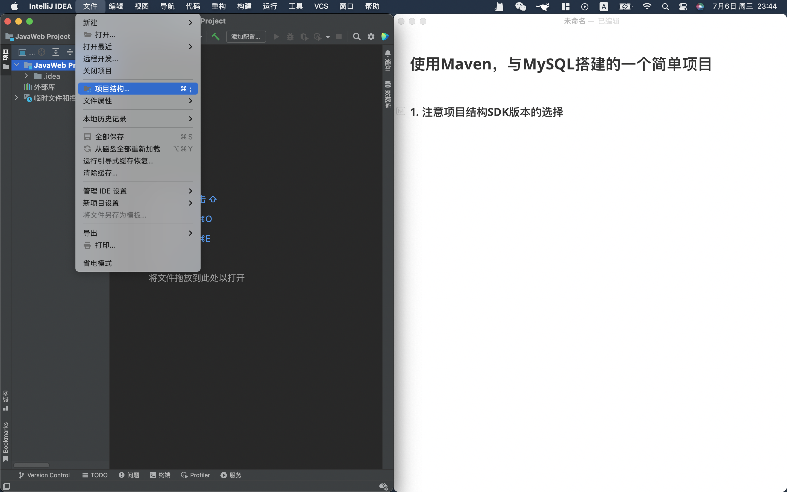
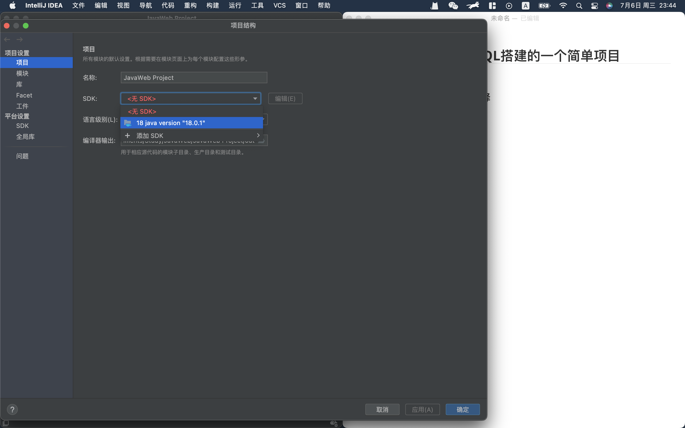
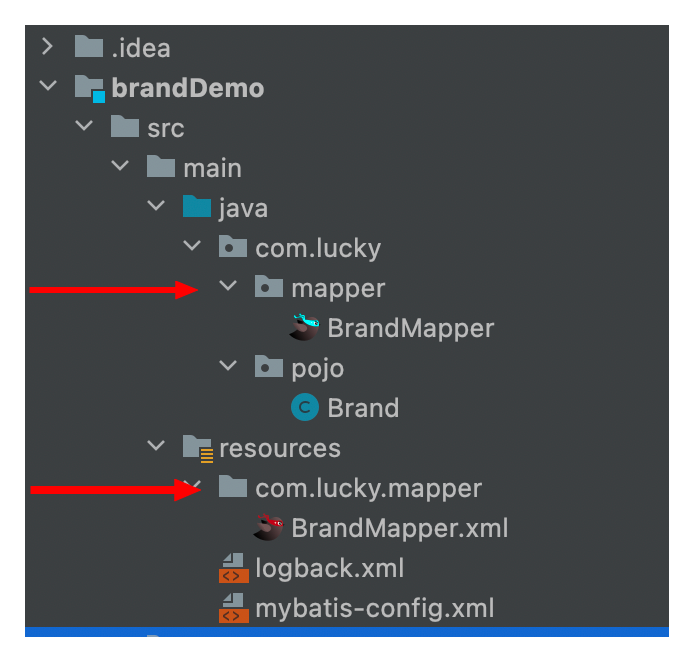

## 使用Maven，与MySQL搭建的一个简单项目


#### 1. 注意项目结构SDK版本的选择

在文件处选择项目结构(如图1)



​																	图1

选择JDK版本(如图2)



​																图2

#### 2. 创建Maven模块

注意JDK版本与图2保持一致


#### 3. 导入坐标，以及log的配置文件

**pom.xml**

```xml
        <!-- mybatis -->
        <dependency>
            <groupId>org.mybatis</groupId>
            <artifactId>mybatis</artifactId>
            <version>3.5.5</version>
        </dependency>

        <!-- mysql 驱动 -->
        <dependency>
            <groupId>mysql</groupId>
            <artifactId>mysql-connector-java</artifactId>
            <version>5.1.46</version>
        </dependency>
        
        <dependency>
            <groupId>junit</groupId>
            <artifactId>junit</artifactId>
            <version>4.13</version>
            <scope>test</scope>
        </dependency>

        <!-- 添加slf4j日志api -->
        <dependency>
            <groupId>org.slf4j</groupId>
            <artifactId>slf4j-api</artifactId>
            <version>1.7.20</version>
        </dependency>
        <!-- 添加logback-classic依赖 -->
        <dependency>
            <groupId>ch.qos.logback</groupId>
            <artifactId>logback-classic</artifactId>
            <version>1.2.3</version>
        </dependency>
        <!-- 添加logback-core依赖 -->
        <dependency>
            <groupId>ch.qos.logback</groupId>
            <artifactId>logback-core</artifactId>
            <version>1.2.3</version>
        </dependency>	
```

logback.xml

```xml
<?xml version="1.0" encoding="UTF-8"?>
<configuration>
    <!--
        CONSOLE ：表示当前的日志信息是可以输出到控制台的。
    -->
    <appender name="Console" class="ch.qos.logback.core.ConsoleAppender">
        <encoder>
            <pattern>[%level] %blue(%d{HH:mm:ss.SSS}) %cyan([%thread]) %boldGreen(%logger{15}) - %msg %n</pattern>
        </encoder>
    </appender>

    <logger name="com.itheima" level="DEBUG" additivity="false">
        <appender-ref ref="Console"/>
    </logger>


    <!--

      level:用来设置打印级别，大小写无关：TRACE, DEBUG, INFO, WARN, ERROR, ALL 和 OFF
     ， 默认debug
      <root>可以包含零个或多个<appender-ref>元素，标识这个输出位置将会被本日志级别控制。
      -->
    <root level="DEBUG">
        <appender-ref ref="Console"/>
    </root>
</configuration>
```


#### 4. 引入Mybatis-config的配置文件

**Mybatis-config.xml**

```xml
<?xml version="1.0" encoding="UTF-8" ?>
<!DOCTYPE configuration
  PUBLIC "-//mybatis.org//DTD Config 3.0//EN"
  "http://mybatis.org/dtd/mybatis-3-config.dtd">
<configuration>
  <environments default="development">
    <environment id="development">
      <transactionManager type="JDBC"/>
      <dataSource type="POOLED">
        <property name="driver" value="${driver}"/>
        <property name="url" value="${url}"/>
        <property name="username" value="${username}"/>
        <property name="password" value="${password}"/>
      </dataSource>
    </environment>
  </environments>
  <mappers>
    <mapper resource="org/mybatis/example/BlogMapper.xml"/>
  </mappers>
</configuration>
```

1. 添加\<typeAliases>的配置信息
   1. 配置存放对象原型的包名，可以防止书写冗余的全限定类名
2. 修改\<environment>中\<dataSource>里面的配置信息
   1. 配置自己的mysql驱动
   2. 以及访问数据库的url连接
   3. 填写用户名以及密码
3. 修改\<mappers>中的配置信息
   1. 配置sql的映射文件
   2. 或者配置存放映射文件的包

**修改后的mybatis-config.xml**

```xml
<?xml version="1.0" encoding="UTF-8" ?>
<!DOCTYPE configuration
        PUBLIC "-//mybatis.org//DTD Config 3.0//EN"
        "http://mybatis.org/dtd/mybatis-3-config.dtd">
<configuration>
    <typeAliases>
        <package name="com.lucky.pojo"/>
    </typeAliases>
    <environments default="development">
        <environment id="development">
            <transactionManager type="JDBC"/>
            <dataSource type="POOLED">
                <property name="driver" value="com.mysql.jdbc.Driver"/>
                <property name="url" value="jdbc:mysql:///mybatis"/>
                <property name="username" value="root"/>
                <property name="password" value="123456"/>
            </dataSource>
        </environment>
    </environments>
    <mappers>
<!--        <mapper resource="org/mybatis/example/BlogMapper.xml"/>-->
        <package name="com.lucky.mapper"></package>
    </mappers>
</configuration>
```


#### 5. 创建SQL映射文件

这里的建议是在依赖中创建与运行类一样的包结构，这样在运行时，xml里面的SQL语句才能和与对应的接口进行映射(如图)


1. 创建SQL映射模版
2. 创建与SQL对应的映射接口
3. 每个SQL语句的ID与返回值类型需要与对应的接口方法保持一致
4. \<mapper>里的namespace为对应的接口路径

**SQL映射模版**

```xml
<?xml version="1.0" encoding="UTF-8" ?>
<!DOCTYPE mapper
        PUBLIC "-//mybatis.org//DTD Mapper 3.0//EN"
        "http://mybatis.org/dtd/mybatis-3-mapper.dtd">
<mapper namespace="org.mybatis.example.BlogMapper">
    <select id="selectBlog" resultType="Blog">
        select * from Blog where id = #{id}
    </select>
</mapper>
```



**修改后的SQL映射文件**

```xml
<?xml version="1.0" encoding="UTF-8" ?>
<!DOCTYPE mapper
        PUBLIC "-//mybatis.org//DTD Mapper 3.0//EN"
        "http://mybatis.org/dtd/mybatis-3-mapper.dtd">
<mapper namespace="com.lucky.mapper.BrandMapper">
    <resultMap id="BrandResult" type="brand">
        <result column="brand_name" property="brandName"/>
        <result column="company_name" property="companyName"/>
    </resultMap>
    <select id="selectAll" resultMap="BrandResult">
        select * from tb_brand;
    </select>
</mapper>
```


#### 6. 从XML中构建SqlSessionFactory

**SqlSessionFactory映射模版**

```java
String resource = "org/mybatis/example/mybatis-config.xml";
InputStream inputStream = Resources.getResourceAsStream(resource);
SqlSessionFactory sqlSessionFactory = new SqlSessionFactoryBuilder().build(inputStream);
```

1. 获取sqlSession
   1. sqlSessionFactory.openSession()
2. 获取映射接口
   1. sqlSession.getMapper()
3. 释放资源

```java
String resource = "mybatis-config.xml";
InputStream inputStream = Resources.getResourceAsStream(resource);
SqlSessionFactory sqlSessionFactory = new SqlSessionFactoryBuilder().build(inputStream);

//获取sqlSession
SqlSession sqlSession = sqlSessionFactory.openSession();

UserMapper mapper = sqlSession.getMapper(UserMapper.class);
List<User> users = mapper.selectAll();

System.out.println(users);
//释放资源
sqlSession.close();
```

