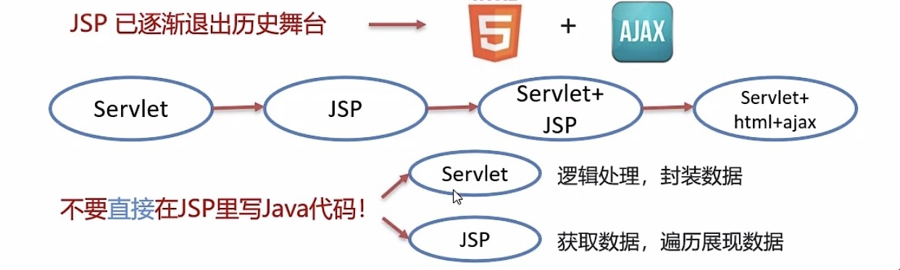

## JSP

#### 快速入门：

1. 导入JSP坐标
2. 创建JSP文件
3. 编写HTML和JAVA代码

#### 简介：

- 概念：Java Server Pages，Java服务端页面
- JSP = HTML + Java，用于简化开发的
- JSP本质上就是一个Servlet
- JSP在被访问时，由JSP容器将其转换为Java文件，由JSP容器将其编译，最终对外提供服务的其实就是这个字节码文件

#### JSP脚本：

- JSP脚本用于在JSP页面内定义Java代码
- JSP脚本分类
  1. <%...%>：内容会直接放到_jspService()方法之中
  2. <%=...%>：内容会放到out.prin()中，作为out.print()的参数
  3. <%!...%>：内容会放到_jspService()方法之外，被类直接包含

#### JSP缺点：

- 由于JSP页面内，既可以定义HTML标签，又可以定义Java代码，造成了以下问题：
  1. 书写麻烦：特别是复杂的页面阅读麻烦
  2. 复杂度高：运行需要依赖于各种环境，JRE，JSP容器，JavaEE...
  3. 占内存和磁盘：JSP会自动生成.java和.class文件占磁盘，运行的是.class占内存
  4. 调试困难：出错后，需要找到自动生成的.java文件进行调试
  5. 不利于团队协作：前端人员不回Java，后端人员不精HTML

#### JSP的技术迭代：

