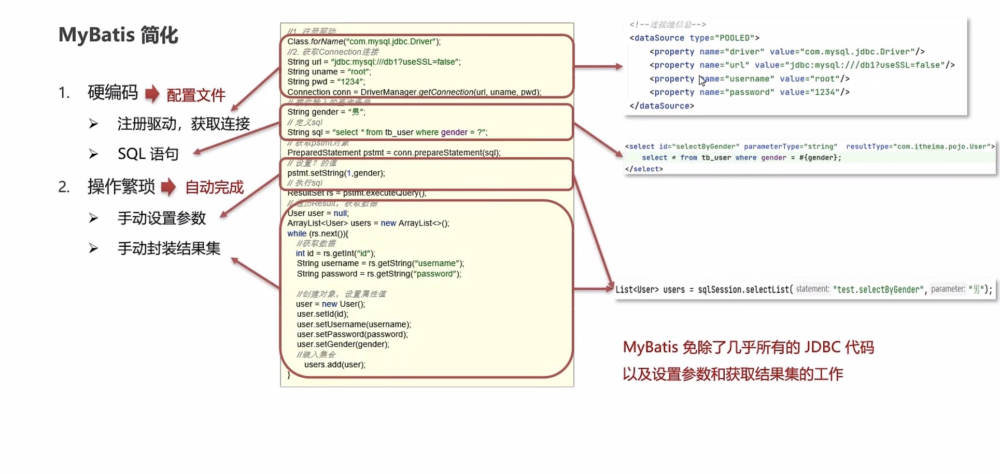

# Mybatis简介

#### 什么是Mybatis?

- Mybatis是一款优秀的**持久层**框架，用于**简化JDBC开发**
- MyBatis 免除了几乎所有的 JDBC 代码以及设置参数和获取结果集的工作。
- MyBatis 可以通过简单的**XML**或**注解**来配置和映射原始类型、接口和 Java POJO（Plain Old Java Objects，普通老式 Java 对象）为数据库中的记录
- Mybatis本是Apache的一个开源项目iBatis，2010年这个项目由apache software foundation 迁移到google code，并且改名为Mybatis。2010年11月迁移到Github

#### 持久层

- 负责将数据到保存数据的那一层代码
- JaveEE三层架构：表现层，业务层，**持久层**

#### 框架

- 框架就是一个半成品软件，是一套可重用的，通用的，软件基础代码模型
- 在框架的基础之上构建软件编写更加高效，规范，通用，可扩展

