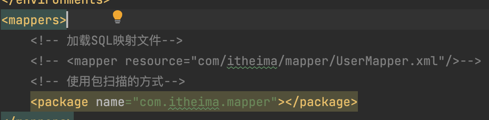

## 使用Mapper代理开发

步骤

1. 定义SQL映射文件同名的Mapper**接口**，并且将**Mapper接口**和**SQL映射文件**放置在**同一目录下**
2. 设置SQL映射文件的namespace属性为**Mapper接口全限定名**
3. 在Mapper接口中定义方法，**方法名就是SQL映射文件中sql语句的id**，并保持**参数类型**和**返回值类型**一致
4. 编码
   1. 通过SqlSession的getMapper方法获取Mapper接口的代理对象
   2. 调用对应方法完成sql的执行

> 注意
>
> 如果Mapper接口名称和SQL映射文件名称相同，并且在同一目录下，则可以使用包扫描的方式简化SQL映射文件的加载

