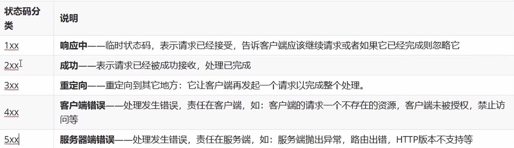

# HTTP协议

#### 概念：

超文本传输协议，规定了浏览器和服务器之间数据传输的规则

#### 特点：

1. 基于TCP协议：面向连接，安全
2. 基于请求-响应模型的：一次请求对应一次响应
3. HTTP协议是无状态的协议：对于事务处理没有记忆能力。每次请求-响应都是独立的
   1. 缺点：多次请求间不能共享数据
   2. 优点：速度快
   3. Java中使用会话技术(Cookie，Session)来解决这个问题

#### 请求：

1. 请求行：请求数据的第一行。包含请求请求方式，请求资源路径，HTTP协议版本
2. 请求头：
   - 从第二行开始，格式为key：value形式
   - **Host**：表示请求的主机名
   - **User-Agent**：浏览器版本
   - **Accpet**：表示浏览器接收的资源类型
   - **Accept-Language**：表示浏览器偏好的语言，服务器可以据此返回不同的语言的网页
   - **Accept-Encoding**：表示浏览器可以支持的压缩类型，例如gzip，deflate等
3. 请求体：
4. **GET**请求和**POST**请求区别：
   1. GET**请求请求参数在请求行**中，没有请求体。POST**请求请求参数在请求体**中
   2. GET请求请求参数大小限制，POST没有

#### 响应：

1. 响应行：
   - 响应数据的第一行。包含协议版本，响应状态码，状态码描述
   - 
2. 响应头：
   - 第二行开始，格式为key：value
   - **Content-Type**：表示该响应内容的类型，例如text/html，image/jpeg；
   - **Content-Length**：表示该响应内容的长度
   - **Content-Encoding**：表示该响应压缩算法，例如gzip
   - **Cache-Control**：指示客户端应如何缓存
3. 响应体：最后一部分。存放响应数据