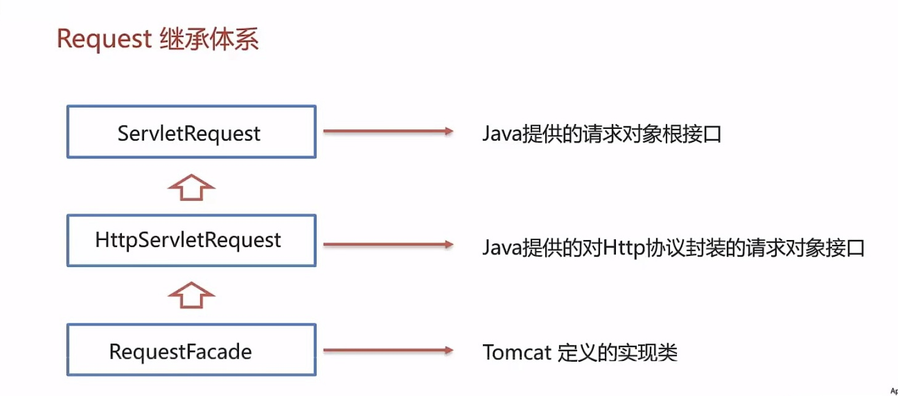

# Request 和 response

## Request：

#### 概述

==Servlet容器==对于接受到的每一个Http请求，都会**创建一个ServletRequest对象**，并把这个对象**传递给Servlet的Sevice( )**方法。其中，ServletRequest对象内**封装了关于这个请求的详细信息**。

#### 继承体系：




- Tomcat需要解析请求数据，封装为request对象，并且创建request对象传递到service方法中
- 使用request对象，查阅JavaEE API文档的HttpServletRequest接口

#### 获取请求数据：

1. 请求行：

   - ```java
   	String getMethod()// 获取请求方式：GET
   	String getContextPath()// 获取虚拟机目录：/request-demo
   	StringBuffer getRequestURL()// 获取URL：http://localhost:8080/request-demo/req1
   	String getRequestURI()// 获取URI：/request-demo/req1
   	String getQueryString()//获取请求参数：username=zhangsan&password=123
   	```

2. 请求头：

   - ```java
   	String getHeader(String name)// 根据请求头名称，获取值
   	```

3. 请求体：

   - ```java
   	ServletInputStream getInputStrema()// 获取字节输入流
   	BufferReader getReader()// 获取字符输入流
   	```

   	

4. 请求参数获取方式：

   1. GET方式：**String getQueryString()**
   2. POST方式：**BufferedReader getReader()**
   3. 通用方式获取请求参数：
      - **Map<string, String[]> getParameterMap()：获取所有参数Map集合**
      - **String getParameterValues(String name)：根据名称获取参数值(数组)**
      - **String getParameter(String name)：根据名称获取参数值(单个值)** 

5. 中文乱码问题解决：

   - post提交方式解决乱码：req.setCharacterEncoding("UTF-8");

   - get提交方式解决乱码：

     - 将返回的值以"ISO-8859-1"的方式进行编码，获得二进制字节数据

     - 在使用utf-8对该字节数据进行解码

     - ```java
       new String(value.getBytes(StandardCharsets.ISO_8859_1),StandardCharsets.UTF_8);
       ```

   - 通用的解决方案

     - ```java
     	new String(value.getBytes(StandardCharsets.ISO_8859_1),StandardCharsets.UTF_8);
     	```

#### 请求转发：

- 简介：一种在服务器**内部**的资源跳转方式
- 实现方式：req.getRequestDispatcher("资源B路径").forward(req,resp);
- 共享数据：使用Request对象
  - ```java
  	void setAttribute(String name, Object o)// 存储数据到request域中
  	Object getAttribute(String name)// 根据key，获取值
  	void removeAttribute(String name)// 根据key，删除该键值对
  	```
- **特点**：
  
  - **浏览器地址栏路径不发生变化**
  - **只能转发到当前服务器的内部资源**
  - 一次请求，可以在转发的资源间使用request共享数据


## Response：

#### 概述：

表示一个Servlet响应，在调用Servlet的Service( )方法前，==Servlet容器==会先创**建一个ServletResponse对象**，并把它作为第二个参数传给Service( )方法。**ServletResponse隐藏了向浏览器发送响应的复杂过程**。

#### 设置响应数据功能结合：

1. 响应行：
   - ```java
   	void setStatus(int sc)：设置响应状态码
   	```
2. 响应头
   - ```java
   	void setHeader(String name, String value)：设置响应头键值对
   	```
3. 响应体
   - ```java
   	PrintWriter getWriter()：获取字符输出流
   	ServletOutputStream getOutputStream()：获取字节输出流
   	```
   
   	

### 完成重定向：

#### 概述：

一种资源跳转方式

#### 操作：

1. 设置状态码：302；						

	- ```java
		resp.setStatus(302);
		```

2. 设置响应头：location: xxx.    	   

	- ```java 
		resp.setHeader("location","资源B的路径")
		```

3. 或者直接使用resp.sendRedirect(location);

#### 特点：

- **浏览器地址栏路径发生改变**
- **可以重定向到任意位置的资源(服务器内部，外部均可)**
- **两次请求，不能在多个资源使用request共享数据**

#### 路径问题：

- 明确路径谁使用？
  - 浏览器使用：需要加虚拟目录(项目访问路径)；
  - 服务端使用：不需要加虚拟目录；

#### 响应字符数据：

1. 设置响应内容类型及编码格式

2. 获取字符输出流

3. 设置输出内容

4. ```java
   resp.setContentType("text/html;charset=utf-8");//设置类型及编码
   PrintWriter writer = resp.getWriter();//获得输出流
   writer.write("你好");//设置输出内容
   writer.write("<h1>aaa</h1>");
   ```

5. 注意

   - 该流不需要关闭，随着响应结束，response对象销毁，由服务器关闭
   - 中文数据乱码；原因通过Response获取字符输出流默认编码ISO-8859-1

#### 响应字节数据：

1. 设置文件输入流
2. 设置响应输出流
3. 将文件输入流的内容复制到响应输出流中
4. 关闭文件输入流


