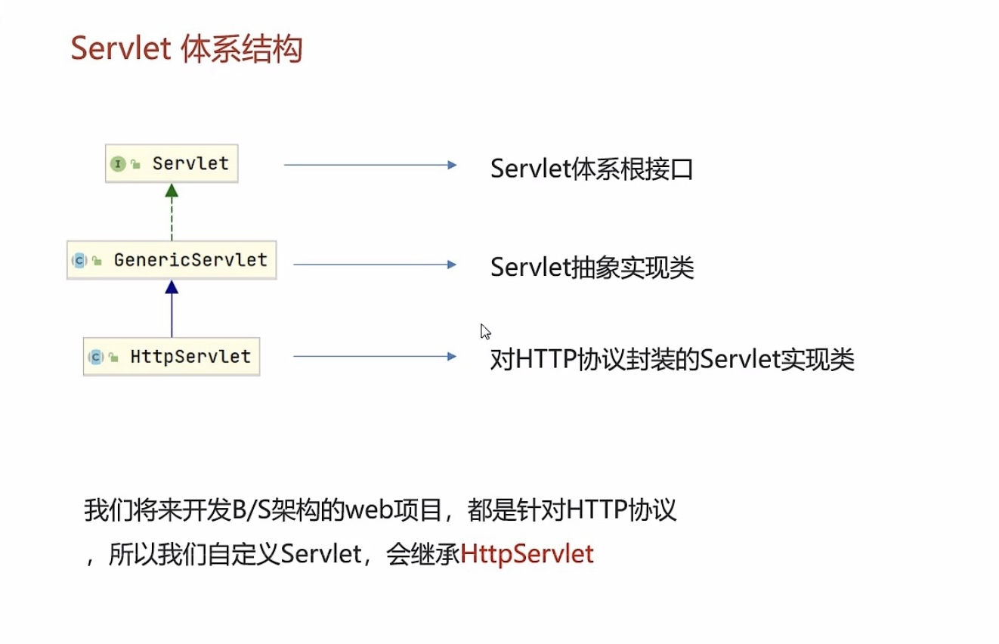

## Servlet

#### Servlet快速入门：

1. 创建web项目，导入Servlet依赖坐标
2. 创建：定义一个类，实现Servlet接口，并重写接口中所有方法，并在service方法中输入一句话
3. 配置：在类上使用@WebServlet注解，配置该Servlet的访问路径
4. 访问：启动Tomcat，浏览器输入url访问该servlet

#### Servlet方法：

1. getServletInfo()：一般返回null
2. getServletConfig()：返回配置信息

#### Servlet体系结构：

1. HttpServlet 使用步骤
   1. 继承HttpServlet
   2. 重写doGet和doPost方法
2. HttpServlet原理
   - 获取请求方式，并根据不同的请求方式，调用不同的doXxx方法

#### Servlet urlPattern配置：

- Servlet要想被访问，必须配置其访问路径

  1. 一个Servlet，可以配置多个urlPattern

  2. urlPattern配置规则

     1. 精确匹配

        - @webServlet("\user\select")
        - 访问路径：localhost:8080/web-demo/user/select

     2. 目录匹配

        - @webServlet("\user\\*")
        - 访问路径：localhost:8080/web-demo/user/aaa

     3. 扩展名匹配

        - 配置路径：@webServlet("*.do")
        - 访问路径：localhost:8080/web-demo/aaa.do
        - 注意这里的开头不能加斜杠

     4. 任意匹配

        - 配置路径：@webServlet("/") @webServlet("/*")
        - 访问路径：localhost:8080/web-demo/hehe
        - 当我们的项目中的Servlet配置"/",会覆盖掉tomcat中的DefaultServlet，当其他的url-pattern都匹配不上时都会走这个Servlet
        - 当我们的项目配置哩"/*"，意味着匹配任意访问路径

     5. > 优先级：精确>目录>扩展名>/*>/

#### XML配置方式编写Servlet：

- Servlet从3.0版本后开始支持使用注解，3.0版本前只支持XML配置文件的配置方式
- 步骤：
  1. 编写Servlet类
  2. 在wel.xml中配置该Servlet