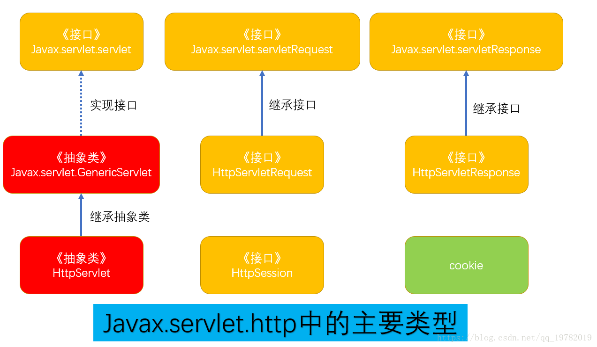

# Servlet简介

#### 简介

`Java Servlet` 是运行在 `Web` 服务器或应用服务器上的程序，它是作为来自 `Web` 浏览器或其他 `HTTP` 客户端的请求和 `HTTP` 服务器上的数据库或应用程序之间的`中间层`。

使用 `Servlet`，您可以收集来自网页表单的用户输入，呈现来自数据库或者其他源的记录，还可以动态创建网页。

- 是`Java`提供的一门动态`web`资源开发技术
- `Servlet`是`JavaEE`规范之一，其实就是一个接口，将来我们需要定义`Servlet`类实现`Servlet`接口，并由`web`服务器运行`Servlet`

## Servlet架构

## Servlet任务

Servlet 执行以下主要任务：

- 客户端发送请求至服务器
- 服务器启动并调用Servlet，Servlet根据客户端请求生成响应内容并将其传给服务器
- 服务器将响应返回客户端

#### Tomcat工作机制

#### Servlet API 预览

Servlet API 包含以下4个Java包：

- javax.servlet   其中包含定义servlet和servlet容器之间契约的类和接口。
- javax.servlet.http   其中包含定义HTTP Servlet 和Servlet容器之间的关系。

- javax.servlet.annotation   其中包含标注servlet，Filter,Listener的标注。它还为被标注元件定义元数据。

- javax.servlet.descriptor，其中包含提供程序化登录Web应用程序的配置信息的类型。

