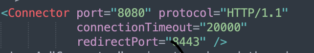
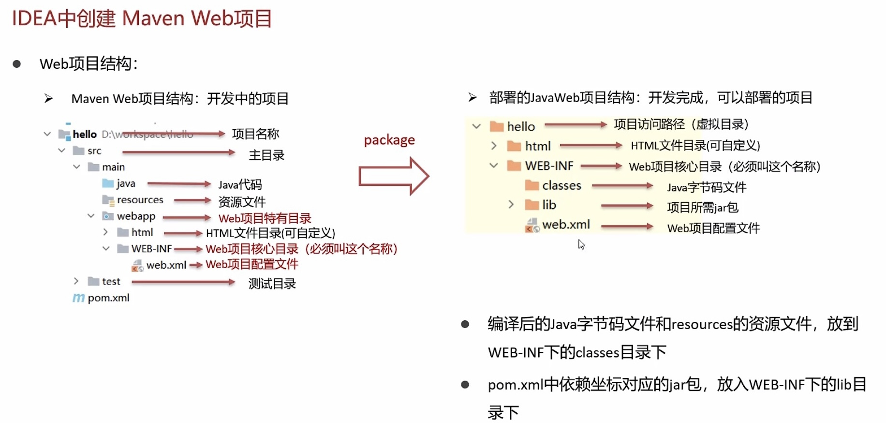

# Web服务器

#### 简介：

web服务器是一个应用程序，对HTTP协议的操作进行封装，使得程序员不必直接对协议进行操作，让web开发更加便捷。**主要功能是“提供网上信息浏览服务”**

### Tomcat

#### 简介：

- **Tomcat**是Apache软件基金会的一个核心项目，是一个开源免费的轻量级Web服务器，支持servlet/JSP少量JavaEE规范
- Tomcat也被称为Web服务器，**Servlet容器**。Servlet需要依赖于Tomcat才能运行

> JaveEE：Java Enterprise Edition，Java企业版。指Java企业级开发的技术规范总和。包含13项技术规范：JDBC，JDNI，EJB，RMI，JSP，Servlet，XML，JMS，JAVA IDL，JTS，JTA，JavaMail，JAF

#### 基本使用：

##### 下载：

##### 安装：

##### 卸载：

##### 启动：

##### 关闭：

##### 配置：

1. 修改启动端口号：conf/server.xml
   1. 
   2. HTTP协议默认端口号为80，如果将Tomcat端口号改为80，将来访问Tomcat时，将不用输入端口号
2. 启动时可能出现的问题：
   1. 端口号冲突：找到对应应用程序，将其关闭掉
   2. 启动窗口一闪而过：检查JAVA_HOME环境变量是否正常配置

##### 部署：

###### Tomcat部署项目：

- 将项目放置到webapps目录下，即部署完成
- 一般JavaWeb项目会被打成war包，然后将war包放到webapps目录下，tomcat会自动解压缩war文件

#### 使用IDEA中创建Maven Web项目

##### Web项目结构

##### 创建项目：

1. 不使用骨架
   1. 直接创建Maven项目
   2. pom.xml中添加打包方式为war包
   3. 补齐缺失的目录结构：webapp
2. 使用骨架
   1. 骨架：项目模版
   2. 使用web项目骨架，创建项目
   3. 删除pom.xml多余的坐标
   4. 补齐缺失的目录结构

> \<packing>war\</packing>
>
> 这里的packing为打包方式
>
> - jar：默认值
> - war：web项目