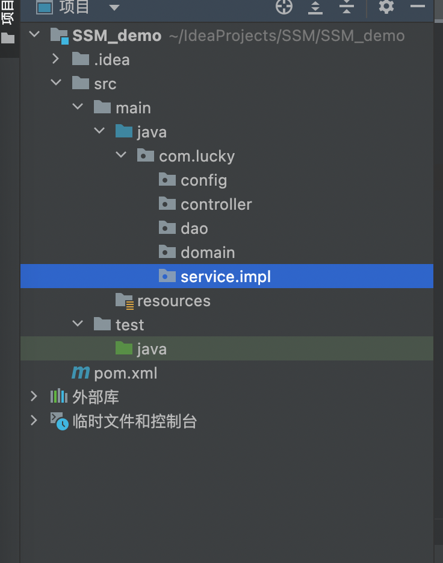

# SSM框架整合

#### 流程

1. 创建工程
2. SSM整合
   - Spring
     - SpringConfig
   - Mybaits
     - MybatisConfig
     - JdbcConfig
     - Jdbc.properties
   - SpringMVC
     - ServletConfig
     - SpringMvcConfig
3. 功能模块
   - 表与实体类
   - dao（接口+自动代理）
   - service（接口+实现类）
     - 业务层接口测试（整合JUnit）
   - controller
     - 表现层接口测试（postman）


#### 具体流程

- 导入坐标

  - ```xml
  	<?xml version="1.0" encoding="UTF-8"?>
  	<project xmlns="http://maven.apache.org/POM/4.0.0"
  	         xmlns:xsi="http://www.w3.org/2001/XMLSchema-instance"
  	         xsi:schemaLocation="http://maven.apache.org/POM/4.0.0 http://maven.apache.org/xsd/maven-4.0.0.xsd">
  	    <modelVersion>4.0.0</modelVersion>
  	
  	    <groupId>org.lucky</groupId>
  	    <artifactId>SSM_demo</artifactId>
  	    <version>1.0-SNAPSHOT</version>
  	
  	    <!--import tomcat plugin-->
  	    <build>
  	        <plugins>
  	            <plugin>
  	                <groupId>org.apache.tomcat.maven</groupId>
  	                <artifactId>tomcat7-maven-plugin</artifactId>
  	                <version>2.1</version>
  	                <configuration>
  	                    <port>80</port>
  	                    <path>/</path>
  	                </configuration>
  	            </plugin>
  	        </plugins>
  	    </build>
  	
  	    <!-- change pack method  -->
  	    <packaging>war</packaging>
  	
  	    <dependencies>
  	        <!-- import spring-webmvc -->
  	        <dependency>
  	            <groupId>org.springframework</groupId>
  	            <artifactId>spring-webmvc</artifactId>
  	            <version>5.2.10.RELEASE</version>
  	        </dependency>
  	
  	        <!-- import spring-jdbc -->
  	        <dependency>
  	            <groupId>org.springframework</groupId>
  	            <artifactId>spring-jdbc</artifactId>
  	            <version>5.2.10.RELEASE</version>
  	        </dependency>
  	
  	        <!-- import spring-test -->
  	        <dependency>
  	            <groupId>org.springframework</groupId>
  	            <artifactId>spring-test</artifactId>
  	            <version>5.2.10.RELEASE</version>
  	        </dependency>
  	
  	        <!-- import mybatis -->
  	        <dependency>
  	            <groupId>org.mybatis</groupId>
  	            <artifactId>mybatis</artifactId>
  	            <version>3.5.6</version>
  	        </dependency>
  	
  	        <!-- import mybatis-spring -->
  	        <dependency>
  	            <groupId>org.mybatis</groupId>
  	            <artifactId>mybatis-spring</artifactId>
  	            <version>1.3.0</version>
  	        </dependency>
  	
  	        <!-- import mysql-connector -->
  	        <dependency>
  	            <groupId>mysql</groupId>
  	            <artifactId>mysql-connector-java</artifactId>
  	            <version>5.1.47</version>
  	        </dependency>
  	
  	        <!-- import druid -->
  	        <dependency>
  	            <groupId>com.alibaba</groupId>
  	            <artifactId>druid</artifactId>
  	            <version>1.1.16</version>
  	        </dependency>
  	
  	        <!-- import junit -->
  	        <dependency>
  	            <groupId>junit</groupId>
  	            <artifactId>junit</artifactId>
  	            <version>4.12</version>
  	            <scope>test</scope>
  	        </dependency>
  	
  	        <!-- import servlet -->
  	        <dependency>
  	            <groupId>javax.servlet</groupId>
  	            <artifactId>javax.servlet-api</artifactId>
  	            <version>3.1.0</version>
  	            <scope>provided</scope>
  	        </dependency>
  	
  	        <!-- import json -->
  	        <dependency>
  	            <groupId>com.fasterxml.jackson.core</groupId>
  	            <artifactId>jackson-databind</artifactId>
  	            <version>2.9.0</version>
  	        </dependency>
  	    </dependencies>
  	
  	
  	    <properties>
  	        <maven.compiler.source>18</maven.compiler.source>
  	        <maven.compiler.target>18</maven.compiler.target>
  	    </properties>
  	
  	
  	
  	</project>
  	```

- 创建文件目录

  - 

- 创建配置文件

  - 创建SpringConfig类

  	- ```java
  		@Configuration// 设置为注释类
  		@ComponentScan("com.lucky.service")// 创建包扫描路径
  		@PropertySource("classpath:jdbc.properties")
  		@Import({JdbcConfig.class,MybatisConfig.class})
  		public class SpringConfig {
  		}
  		```

  - 创建JdbcConfig类

  	- ```java
  		public class JdbcConfig {
  		
  		    // 创建属性
  		    @Value("${jdbc.driver}")
  		    private String driver;
  		    @Value("${jdbc.url}")
  		    private String url;
  		    @Value("${jdbc.username}")
  		    private String username;
  		    @Value("jdbc.password")
  		    private String password;
  		
  		    // 创建数据源，提交到容器中
  		    @Bean
  		    public DataSource dataSource(){
  		        DruidDataSource dataSource = new DruidDataSource();
  		        dataSource.setDriverClassName(driver);
  		        dataSource.setUrl(url);
  		        dataSource.setUsername(username);
  		        dataSource.setPassword(password);
  		        return dataSource;
  		    }
  		}
  		```
  		
	- 创建jdbc.properties
  	
		- ```properties
  			jdbc.driver = com.mysql.jdbc.Driver
  			jdbc.url = jdbc:mysql:///db1
  			jdbc.username = root
  			jdbc.password = 123456
  			```
  	
- 创建MybatisConfig
  
  - ```java
    	public class MybatisConfig {
    	    
    	    // 创建sqlSessionFactory
    	    // 使用SqlSessionFactoryBean创建对象，方便创建对象
    	    @Bean
    	    public SqlSessionFactoryBean sqlSessionFactory(DataSource dataSource){
    	        SqlSessionFactoryBean factoryBean = new SqlSessionFactoryBean();
    	        factoryBean.setDataSource(dataSource);// 设置数据源
    	        factoryBean.setTypeAliasesPackage("com.lucky.domain");
    	        return factoryBean;
    	    }
    	    
    	    // 创建mapper文件
    	    @Bean
    	    public MapperScannerConfigurer mapperScannerConfigurer(){
    	        MapperScannerConfigurer msc = new MapperScannerConfigurer();
    	        msc.setBasePackage("com.lucky.dao");
    	        return msc;
    	    }
    	}
    	```

  - 创建ServletConfig

  	- ```java
  		public class ServletConfig extends AbstractAnnotationConfigDispatcherServletInitializer {
  		
  		    @Override
  		    protected Class<?>[] getRootConfigClasses() {
  		        return new Class[]{SpringConfig.class};
  		    }
  		
  		    @Override
  		    protected Class<?>[] getServletConfigClasses() {
  		        return new Class[]{SpringMvcConfig.class};
  		    }
  		
  		    @Override
  		    protected String[] getServletMappings() {
  		        return new String[]{"/"};
  		    }
  		}
  		```

  - 创建SpringMvcConfig

  	- ```java
  		@Configuration
  		@ComponentScan("com.lucky.controller")
  		@EnableWebMvc
  		public class SpringMvcConfig {
  		}
  		```

- 配置模块

  - 在数据库中创建Book表

  - 创建Book实体类(**也可以使用lombok注解快捷开发实体类**)

    - ```java
      public class Book {
      
          private Integer id;
          private String type;
          private String name;
          private String description;
      
          @Override
          public String toString() {
              return "Book{" +
                      "id=" + id +
                      ", type='" + type + '\'' +
                      ", name='" + name + '\'' +
                      ", description='" + description + '\'' +
                      '}';
          }
      
          public int getId() {
              return id;
          }
      
          public void setId(int id) {
              this.id = id;
          }
      
          public String getType() {
              return type;
          }
      
          public void setType(String type) {
              this.type = type;
          }
      
          public String getName() {
              return name;
          }
      
          public void setName(String name) {
              this.name = name;
          }
      
          public String getDescription() {
              return description;
          }
      
          public void setDescription(String description) {
              this.description = description;
          }
      }
      ```

  - 创建BookDao(创建接口，MyBatis实现动态代理)

    - ```java
      public interface BookDao {
          
          @Insert("insert into book values(null, #{type}, #{name}, #{description})")
          void save(Book book);
      
          @Update("update book set type=#{type}, name=#{name}, description=#{description} where id=#{id}")    
          void update(Book book);
      
          @Delete("delete from book where id=#{id}")
          void delete(Integer id);
      
          @Select("select * from book where id = #{id}")
          Book getById(Integer id);
      
          @Select("select * from book")
          List<Book> getAll();
      }
      
      ```

  - 创建BookService

    - ```java
      public interface BookService {
      
          /**
           * 保存
           * @param book
           * @return
           */
          boolean save(Book book);
      
          /**
           * 修改
           * @param book
           * @return
           */
          boolean update(Book book);
      
          /**
           * 根据Id删除
           * @param id
           * @return
           */
          boolean delete(Integer id);
      
          /**
           * 根据ID查找
           * @param id
           * @return
           */
          Book getById(Integer id);
      
          /**
           * 查询所有
           * @return
           */
          List<Book> getAll();
      
      }
      ```

    - 完成Service的实现类

      - ```java
        @Service
        public class BookServiceImpl implements BookService {
        
            @Autowired
            private BookDao bookDao;
        
        
            @Override
            public boolean save(Book book) {
                bookDao.save(book);
                return true;
            }
        
            @Override
            public boolean update(Book book) {
                bookDao.save(book);
                return true;
            }
        
            @Override
            public boolean delete(Integer id) {
                bookDao.delete(id);
                return true;
            }
        
            @Override
            public Book getById(Integer id) {
                return bookDao.getById(id);
            }
        
            @Override
            public List<Book> getAll() {
                return bookDao.getAll();
            }
        }
        ```

    - 创建BookController

      - ```java
        @RestController
        @RequestMapping("/books")
        public class BookController {
        
            @Autowired
            private BookService bookService;
        
            @PostMapping
            public boolean save(@RequestBody Book book) {
                return bookService.save(book);
            }
        
            @PutMapping
            public boolean update(@RequestBody Book book) {
                return bookService.update(book);
            }
        
            @DeleteMapping("/{id}")
            public boolean delete(@PathVariable Integer id) {
                return bookService.delete(id);
            }
        
            @GetMapping("/{id}")
            public Book getById(@PathVariable Integer id) {
                return bookService.getById(id);
            }
        
            @GetMapping
            public List<Book> getAll() {
                return bookService.getAll();
            }
            
        }
        ```

- 接口测试

  - 使用Junit对业务层进行测试
  - 使用Postman对表现层测试


#### 统一前后端数据传输协议

- 设置统一数据返回结果类

	- ```java
		public class Result{
		    private Object data;
		    private Integer code;
		    private String msg;
		}
		```

	- > Result类中字段并不是固定的，可以根据需要自行增减
		>
		> 提供若干个构造方法，方便操作

