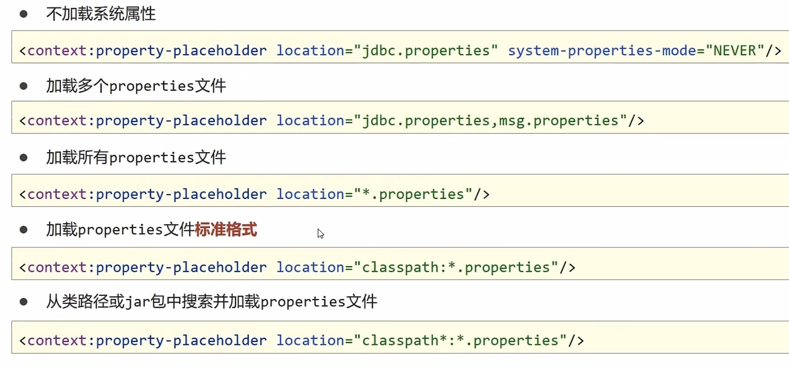
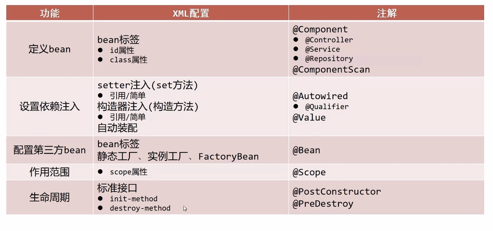

# 依赖注入

- 思考：向一个类中传递数据的方式有几种？
  - **普通方法(set方法)**
  - 构造方法
- 思考：依赖注入描述了在容器中建立bean与bean之间的依赖关系，如果bean运行需要的是数字或字符串呢？
  - **引用类型**
  - **简单类型**


------

<center>使用XMl配置</center>

#### 依赖注入方式

- **setter注入**（重点）
  - 简单类型
  - 引用类型
  - 步骤
    - 在`bean`中定义引用类型属性并提供可访问的setter方法
    - 配置中使用`property`标签,`value`属性注入简单类型数据,`name`属性注入在类中的属性名
    - 配置中使用`property`标签,`ref`属性注入引用类型的bean的id,`name`属性为在类中的属性名
- 构造器注入
  - **缺点：耦合度高**
  - 简单类型
  - 引用类型
  - 步骤
    - 在bean中定义引用类型属性并提供可访问的构造方法
    - 配置中使用`constructor-arg`标签去代替`property`标签，`name`,`ref`,`value`属性内容不改变
        - 这里注意`name`应该与构造器的形参名一致
        - 为解决耦合度过高，新添了`index`与`type`两个属性


#### 依赖注入方式选择性考虑

- 强制依赖使用构造器进行，使用setter注入有概率不进行注入导致null对象出现
- 可选依赖使用setter注入进行，灵活性强
- **Spring框架倡导使用构造器，第三方框架内部大多数采用构造器注入的形式进行数据初始化，相对严谨**
- **如果有必要可以两者同时使用，使用构造器注入完成强制依赖的注入，使用setter注入完成可选依赖的注入**
- 实际开发过程中还要根据实际情况分析，如果受控对象没有提供setter方法就必须使用构造器注入
- **自己开发的模块推荐使用setter注入**


#### 自动装配依赖

- 使用bean标签中的autowird属性，选择查找依赖的方式，
- 特征
	- 自动装配用于类型依赖注入，**不能对简单类型进行操作**
	- **使用按类型装配时**，必须保障容器中相同类型的bean唯一，**推荐使用**
	- 使用按名称装配时，必须保障容器中具有指定名称的bean，因变量名与配置耦合，不推荐使用
	- 自动装配优先级低于setter注入与构造器注入，同时出现时自动装配配置失效


#### 集合注入

- 注入list对象

- 注入array对象

- 注入set对象

- 注入map对象

- 注入Properties对象

	- 步骤1（list,array,set）

		- ```java
			private int[] array;
			
			public void setArray(int[] array) {
			  this.array = array;
			}
			```

		- ```xml
			<property name="array" >
			  <array>
			    <value>100</value>
			    <value>200</value>
			    <value>300</value>
			  </array>
			</property>
			```

	- 步骤2（map）

		- ```java
			private Map<String,String> map;
			```

		- ```xml
			<property name="map">
			  <map>
			    <entry key="country" value="china"/>
			  </map>
			</property>
			```

	- 步骤3（property）

		- ```java
			private Properties properties;
			```

		- ```xml
			<property name="properties">
			  <pros>
			    <prop key="country">china</prop>
			  </pros>
			</property>
			```


> 如果集合元素为引用类型，则使用ref来应用对应的bean类型
>
> ```xml
> <properites name="list">
>   <list>
>     <ref bean="beanId1"/>
>     <ref bean="beanId2"/>
>   </list>
> </properites>
> ```


#### 加载properties文件

1. 开启context命名空间
2. 使用context命名空间，加载制定properties文件
3. 使用${}读取加载的属性值
4. 

**注意事项**




------

<center>使用注解进行注入</center>

#### 注解开发定义bean

- 使用注解定义类

- 在配置文件中打开注解扫描

- Spring提供`@Component`注解开发的三个衍生注解

	- `@Conroller`：用于表现层bean定义
	- `@Service`：用于业务层bean定义
	- `@Repository`：用于数据层bean定义

- 步骤

	- ```java
		@Component("userDao")
		public class UserDaoImpl implements UserDao {
		
		    @Override
		    public void save() {
		        System.out.println("UserDaoImpl save ...");
		    }
		}
		```

	- ```xml
		<context:component-scan base-package="com.lucky.dao.impl"/>
		```


#### 纯注解开发

- Spring3.0升级了纯注解开发模式，使用Java类替代配置文件，开启了Spring快速开发通道

- 读取Spring核心配置文件初始化容器对象切换为读取Java配置类初始化容器对象

	- 使用`@Configuration`注解用于设定当前类为配置类

	- 使用`@ComponentScan`注解用于设定扫描路径，此注解只能添加一次，多个数据请用数组格式

- 使用读取注解配置类获得容器

- 步骤

	- ```java
		ApplicationContext ctx = new AnnotationConfigApplicationContext(SpringConfig.class);
		```

	- ```java
		@Configuration
		@ComponentScan("com.lucky")
		public class SpringConfig {
		}
		```

		


#### 注解开发bean作用范围与生命周期管理

- 使用`@Scope`定义`bean`作用范围
- 使用`@PostConstruct`，`@PreDestroy`定义bean生命周期
- 注意
	- 使用`PostConstruct`或者`PreDestroy`需要导入`Javax.annotation`依赖
	- 使用单例模式销毁钩子才会被触发


#### 注解开发依赖注入

- 使用`@Autowired`注解开启自动装配模式（按类型）
	- 注意：自动装配基于反射设计创建对象并**暴力反射对应属性为私有属性初始化数据**，因此无需提供setter方法
	- 注意：自动装配建议使用无参构造方法创建对象，如果不提供对应构造方法，请提供唯一的构造方法
- 使用`@Qualifier`注解开启指定名称装配`bean`
	- 注意：`@Qualifier`注解无法单独使用，必须配合@Autowired注解使用
- 使用`@Value`注解对类的基本数据类型进行赋值
- 使用`@PropertySource`注解加载`properties`文件
	- 注解写在`SpringConfig`上
	- 注意：路径仅支持单一文件配置，多文件请使用数组格式配置，不允许使用通配符*


#### 注解开发管理第三方bean

- ==使用`@Bean`配置第三方bean==
- 使用独立的配置类管理第三方bean
- 将独立的配置类加入核心配置
	- 方式一：**导入式**（**重点**）
		- 使用**@import**注解手动加入配置类到核心配置，**此注解只能添加一次，多个数据请用数组格式**
	- 方式二：扫描式（不推荐）
		- 使用**@ComponentScan**注解扫描配置类所在的包，加载对应的配置类信息

- 步骤：

	- ```java
		//使用@Bean注解进行配置第三方bean
		public class JdbcConfig(){
		  @Bean
		  public DataSource dataSource(){
		    DruidDataSource ds = new DruidDataSource();
		    ds.setDriverClassName();
		    ds.setUrl();
		    ds.setUsername();
		    ds.setPassword();
		    return ds;s
		  }
		}
		```

	- ```java
		@Configuration
		@import(JdbcConfig.class)
		public class SpringConfig(){
		}
		```

		

- 简单类型依赖注入

	- 使用`@Value`为变量赋值

	- ```java
		public class JdbcConfig(){
		    
		    @Value("com.mysql.jdbc.Driver")
		    private String driver;
		    @Value("jdbc:mysql:///db1")
		    private String url;
		    @Value("root")
		    private String userName;
		    @Value("123456")
		    private String password;
		    
		    @Bean
		    public DataSource dataSource(){
		        DruidDataSource ds = new DruidDataSource();
		        ds.setDriverClassName();
		        ds.setUrl();
		        ds.setUsername();
		        ds.setPassword();
		      }
		}
		```

		

- 引用类型依赖注入

	- 引用类型注入只需要为`bean`定义方法设置行参即可，容器会根据类型自动装配对象

	- ```java
		@Repository
		public interface BookDao(){
		    void save();
		}
		```

	- ```java
		public class JdbcConfig(){
		    
		    @Value("com.mysql.jdbc.Driver")
		    private String driver;
		    @Value("jdbc:mysql:///db1")
		    private String url;
		    @Value("root")
		    private String userName;
		    @Value("123456")
		    private String password;
		    
		    @Bean
		    public DataSource dataSource(BookDao bookDao){
		        DruidDataSource ds = new DruidDataSource();
		        ds.setDriverClassName();
		        ds.setUrl();
		        ds.setUsername();
		        ds.setPassword();
		      }
		}
		```

		

#### 总结

XML配置与注解配置比较



