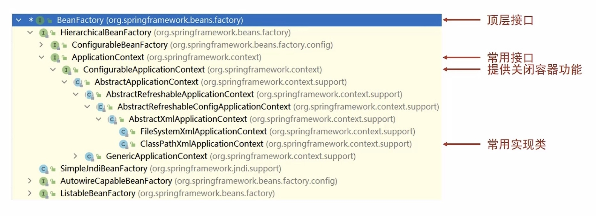

## 容器

### 创建容器

- `ClassPathXmlApplicationContext`：加载类路径下的配置文件
- `FileSystemXmlApplicationContext`：从文件系统下加载配置文件

### 容器类层次结构

#### BeanFactory

`BeanFactory`是`ApplicationContext`的顶层接口

区别：

- `BeanFactory`延迟加载`bean`
- `ApplicationContext`是立即加载`bean`