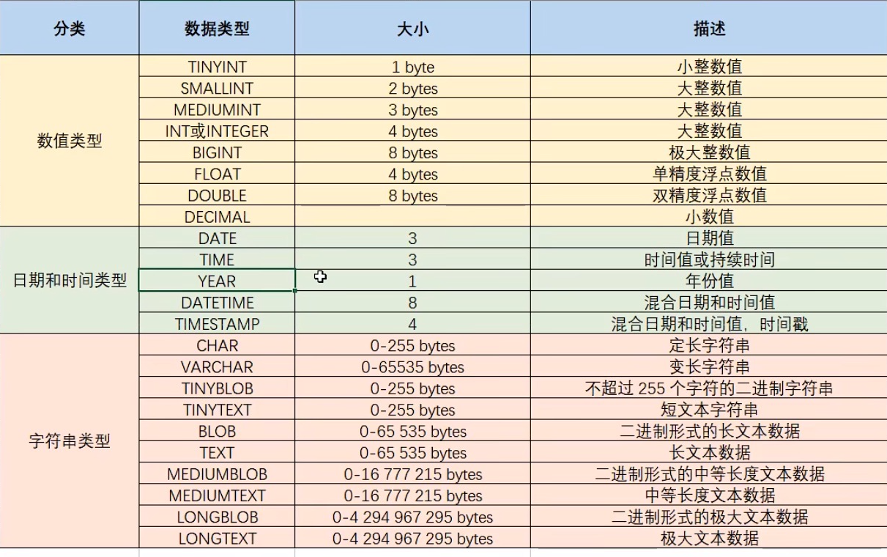

## DDL--操作表

#### 1. 查询表

```mysql
show tables;-- 查询当前数据库下所有表名称
```

```mysql
desc 表名称;-- 查询表结构
```

#### 2. 创建表

```mysql
create table 表名(
	字段名1 数据类型1,
	字段名2 数据类型2,
	……
);
```

##### 数据类型



##### 常用数据类型

1. int
2. double(数据的总长度,小数点保留的位数)
3. date
4. char(10) 定长字符串 10个字符空间 存储性能高 浪费空间
5. varchar(10)  变长字符串 2个字符空间 存储性能低 节约空间

#### 3. 删除表

```mysql
drop table 表名;
```

#### 4. 修改表

##### 1. 修改表名

```mysql
alter table 表名 rename to 新的表名;
```

##### 2. 添加一列

```mysql
alter table 表名 add 列名 数据类型;
```

##### 3. 修改数据类型

```mysql
Alter table 表名 modify 列名 新数据类型;
```

##### 4. 修改列名和数据类型

```mysql
alter table 表名 change 列名 新列名 新数据类型;
```

##### 5. 删除列

```mysql
alter table 表名 drop 列名;
```

