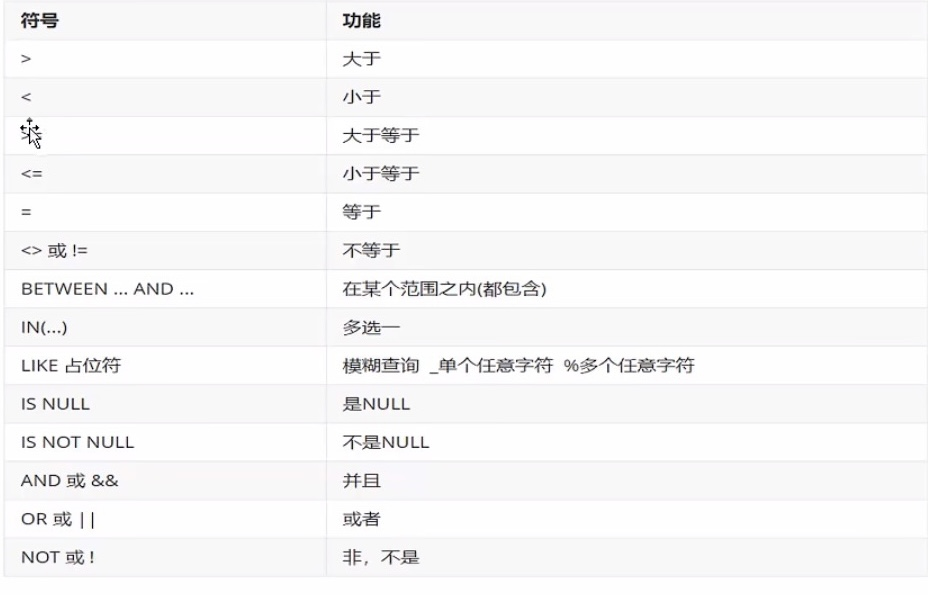

## DQL--数据查询

#### 查询数据

```mysql
select
	字段列表
FROM
	表名列表
where
	条件列表
GROUP BY
	分组字段
HAVING
	分组后条件
ORDER BY
	排序字段
LIMIT
	分页限定
```


#### 1. 基础查询

- 查询多个字段

```mysql
select 字段列表 from 表名;
select * from 表名;-- 查询所有数据
```

- 去除重复字段

```mysql
select distinct 字段列表 from 表名
```

- 起别名

```mysql
AS: AS 也可以省略
```

#### 2. 条件查询

条件查询语法

```mysql
select 字段列表 from 表名 where 条件列表;
```




#### 模糊查询

使用like作为占位符

通配符

1. _: 代表单个任意字符
2. %: 代表任意个数字符


#### 排序查询

语法

```mysql
select 字段列表 from 表名 order by 排序字段名1,[排序方式1],排序字段2,[排序方式2]...
```

排序方式

- ASC: 升序排列

- DESC: 降序排列


> 注意：如果有多个排序条件，当前边的条件值一样时，才会根据第二条件进行排序


#### 分组查询

##### 聚合函数

1. count : 
   1. 统计数量
   2. 取值：
      1. 主键
      2. *
2. max: 求最大值
3. min: 求最小值
4. sum: 求和
5. avg: 求平均值

> select 聚合函数名(列名) from 表;
>
> null值不参与所有聚合函数运算

##### 分组函数

```mysql
select 字段列表 from 表名 [where 分组前的限定条件] group by 分组字段名 [having 分组后的过滤条件]
```

> 注意： 分组之后，查询的字段为聚合函数和分组字段，查询其他字段无任何意义
>
> where 和 having 的区别
>
> -  执行时机不一样：where是分组之前进行限定，不满足where条件，则不参与分组，而having是分组之后对结果进行过滤
> - 可判断条件不一样：where不能对聚合函数进行判断，having可以


#### 分页查询

```mysql
select 字段列表 from 表名 limit 起始索引,查询条目数
```

- 起始索引：从0开始
- 计算公式：起始索引=(当前页码-1)*每页显示的条数

> 分页查询
>
> 分页查询limit是mysql数据库的方言
>
> oracle分页查询使用rownumber
>
> SQL Server分页查询使用top

