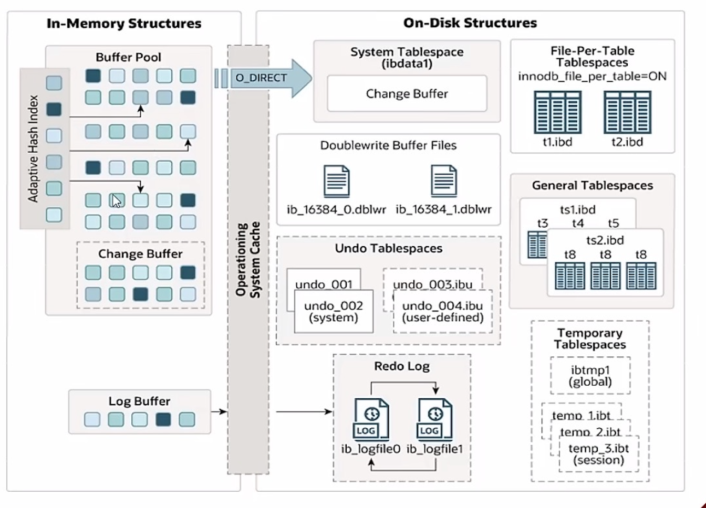
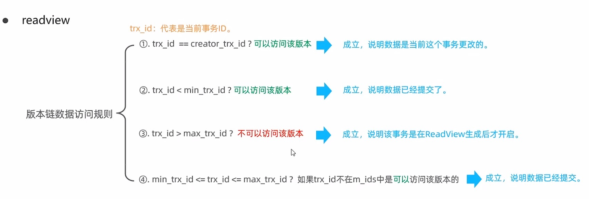

# InnoDB引擎

## 逻辑存储结构

**表空间**：一个mysql实例可以对应多个表空间，用于存储记录，索引等数据

**段**：分为数据段，索引段，回滚段，InnoDB是索引组织表，数据段就是B+树段叶子节点索引段即为B+树段非叶子结点。段用来管理多个extent

**区**：表空间的单元结构，每个区大小为1M。默认情况下，InnoDB存储引擎页大小为16K，即一个区一共有64个连续的页

**页**：是InnoDB存储引擎磁盘管理的最小单元，每个页的默认大小为16KB。为了保证页的连续性，InnoDB存储引擎每次从磁盘申请4-5个区。

**行**：InnoDB存储引擎是按行进行存放的。

> **Trx id**：每次对某条记录进行改动时，都会把对应的事务id赋值给trx_id隐藏列
>
> **Roll_pointer**：每次对某条记录进行改动时，都会把旧的版本写入到undo日志中，然后这个隐藏类列就相当于一个指针，可以通过它来找到该记录修改前的信息。

## 架构

#### 内存架构

**Buffer Pool**:缓冲池是主内存中的一个区域，里面可以缓存磁盘上经常操作的真实数据，在执行增删改查操作时，先操作缓冲池中的数据(若缓冲池没有数据，则从磁盘加载并缓存)，然后再以一定频率刷新到新磁盘中，从而减少磁盘IO，加快处理速度。

缓冲池以page页为单元，底层采用链表数据结构管理Page。根据状态，将Page分为三种类型：

- free page：空闲page，未被使用。
- clean page：被使用page，数据没有被修改过。
- dirty page：脏页，被使用page，数据被修改过，也与磁盘中的数据产生了不一致。

**Change Buffer**：更改缓冲区(针对非唯一二级索引页)，在执行DML语句时，如果这些数据Page没有在Buffer Pool中，不会直接操作磁盘，而会将数据变更在更改缓冲区Change Buffer中，在未来数据被读取时，再将数据合并到恢复到Buffer Pool中，再将合并的数据刷新到新磁盘中。

> **Change Buffer意义**
>
> 与聚集索引不同，二级索引通常是非唯一的，并且以相对随机的顺序插入二级索引。同样，删除和更新可能会影响索引树中不相邻的二级索引页，如果每一次操作磁盘，会造成大量磁盘IO。有了ChangeBuffer之后，我们可以在缓冲池中进行合并处理，减少磁盘IO。

**Adaptive Hash index**：自适应哈希索引，用于优化对Buffer Pool数据的查询。InnoDB存储引擎会监控对表中上各索引页的查询，如果观察到hash索引可以提升速度，则建立hash索引，称之为hash索引。

自适应hash索引，无需人工干预，是系统根据情况自动完成，

参数：adaptive_hash_index

**Log Buffer**：日志缓冲区，用来保存要写入到磁盘中的log日志数据(redo log, undo log)，默认大小为16MB，日志缓冲区的日志会定期刷到磁盘中。如果需要更新，插入或删除许多行的事务，增加日志缓冲区的大小可以节省磁盘I/O

参数：

Innodb_log_buffer_size：缓冲区大小

Innodb_flush_log_at_trx_commit：日志刷新到磁盘时机

> 1：日志在每次事务提交时写入并刷新到磁盘
>
> 0：每秒将日志写入并刷新磁盘一次
>
> 2：日志在每次事务提交后写入，并每秒刷新到磁盘一次。

#### 磁盘架构

**System Tablespace**:系统表空间是更改缓冲区的存储区域。如果表是在系统表空间而不是每个表文件或通用表空间中创建的，他可能包含表和索引数据。（在MySQL5.x版本中还包含InnoDB数据字典，undolog等）

参数：innodb_data_file_path

**File-Per-Table-Tablespaces**：每个表的文件表空间包含单个InnoDB表的数据和索引，并存储在文件系统上的单个数据文件中。

参数：InnoDB_file_per_table

**General Tablespeces**:通用表空间，需要通过 CREATE TABLESPACE语法创建通用表空间，可以指定该表空间

**Undo Tablespaces**：撤销表空间，MySQL实例在初始化时会自动创建两个默认的undo表空间（初始大小16M），用于存储undo log日志。

**Doublewrite Buffer Files**：双写缓冲区，InnoDB引擎将数据页从Buffer Pool刷新到磁盘前，先将数据页写入到双写缓冲区文件中，便于系统异常时恢复数据。

**Redo log**：重做日志，是用来实现事务的持久性。该日志文件由两部分组成：重做日志缓冲以及重做日志文件，前者是在内存中，后者在磁盘中。当事务提交后会把所有修改信息都会存到该日志中，用于刷新脏页到磁盘时，发生错误时，进行数据恢复使用。

#### 后台线程

**Master Thread**

核心后天线程，负责调度其他线程，还负责缓冲池中的数据异步刷新到磁盘中，保持数据的一致性，还包括脏页的刷新，合并插入缓存，undo页的回收

**IO Thread**

在InnoDB存储引擎中大量使用AIO来处理IO请求，这样可以极大提高数据库的性能，而IO Thread主要负责这些IO请求的回调。

**Purge Thread**

主要回收事务已经提交了undo log，在事务提交之后，undo log可能不用了，就用它来回收

**Page Cleaner Thread**

协助Master Thread刷新脏页到磁盘的线程，它可以减轻Master Thread的工作压力，减少阻塞。

## 事务原理

**事务**

事务 是一组操作的集合，它是一个不可分割的工作单位，事务会把所有的操作作为一个整体一起向系统提交或撤销操作请求，即这些操作要么同时成功，要么同时失败。

**特性**

- **原子性**
- **一致性**
- **隔离性**
- **持久性**

**redo log**

重做日志文件，记录的是事务提交时数据页的物理修改，是用来实现事务的持久性。

该日志文件由两部分组成：重做日志缓冲以及重做日志文件，前者是在内存中，后者在磁盘中。当事务提交之后会把所有修改信息都存到该日志文件中，用于在刷新脏页到磁盘，发生错误时，进行数据恢复使用。

**undo log**

回滚日志，用于记录数据被修改前的信息，作用包含两个：提供回滚 和MVCC(多版本并发控制)。

undo log和redo 1og记录物理日志不一样，它是逻辑日志。可以认为当delete一条记录时，undo log中会记录一条对应的insert记录，反之亦然，当update一条记录时，它记录一条对应相反的update记录。当执行rollback时，就可以从undo log中的逻辑记录读取到相应的内容并进行回滚。

Undo log销毁：undo log在事务执行时产生，事务提交时，并不会立即州除undo log，因为这些日志可能还用于MVCC。
Undo log存储：undo log采用段的方式进行管理和记录，存放在前面介绍的rollback segment 回滚段中，内部包含1024个undo log segment.

## MVCC

#### 基本概念

- 当前读

	读取的是记录的最新版本，读取时还要保证其他并发事务不能修改当前记录，会对读取的记录进行加锁。对于我们日常的操作，如：

	select ... lock in share mode(共享锁)， select ... for update、update、insert、delete(排他锁)都是一种当前读。

- 快照读

	简单的select（不加锁）就是快照读，快照读，读取的是记录数据的可见版本，有可能是历史数据，不加锁，是非阻塞读。

	- Read Committed： 每次select，都生成一个快照读。
	- Repeatable Read： 开启事务后第一个select语句才是快照读的地方。
	- Serializable：快照读会退化为当前读。

- MVCC
	全称 Multi-Version Concurrency Control，多版本并发控制。指维护一个数据的多个版本，使得读写操作没有冲突，快照读为MySQL实现
	MVCC提供了一个非阻塞读功能。MVCC的具体实现，还需要依赖于数据库记录中的三个隐式字段、undo log日志、readView
	級软件人才

#### **记录中的隐藏字段**

| 隐藏字段    | 含义                                                         |
| ----------- | ------------------------------------------------------------ |
| DB_TRX_ID   | 最近修改事务ID，记录插入这条记录或最后一条修改该记录的事务ID |
| DB_ROLL_PTR | 回滚指针，指向这条记录的上一个版本，用于配合undo log,指向上一个版本 |
| DB_ROW_ID   | 隐藏主键，如果表结构没有指定主键，将会生成该隐藏字段         |
|             |                                                              |

#### Undolog版本链

**undo log**

- 回滚日志，在insert、update、delete的时候产生的便于数据回滚的日志。
- 当insert的时候，产生的undo log日志只在回滚时需要，在事务提交后，可被立即州除。
- 而update、delete的时候，产生的undo log日志不仅在回滚时需要，在快照读时也需要，不会立即被删除。

> 不同事务或相同事务对同一条记录进行修改，会导致该记录的undolog生成一条记录的版本链，链表的头部时最新的旧记录，链表尾部是最早的旧记录。

**Readview**

readview
ReadView （读视图）是 快照读 SQL执行时MVCC提取数据的依据，记录并维护系统当前活跃的事务（未提交的）id.
ReadView中包含了四个校心字段：

| 字段            | 含义                                              |
| --------------- | ------------------------------------------------- |
| `m_ids`         | 当前活跃的事务ID集合                              |
| `min_trx_id`    | 人最小活跃事务ID                                  |
| `max_trx_id`    | 预分配事务ID，当前最大事务ID+1（因为事务1是自增的 |
| `creatortrx_id` | Readview创建 者的事务1                            |

不同的隔离级别，生成ReadView的时机不同：

- READ COMMITTED：在事务中每一次执行快照读时生成Readview。

- REPEATABLE READ：仅在事务中第一次执行快照读时生成Readview，后续复用该ReadView。