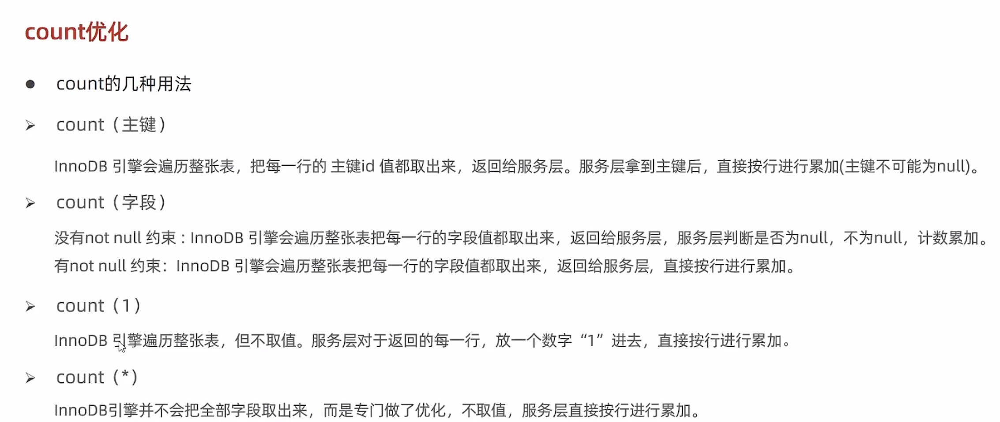

# SQL优化

## 插入数据

- **批量插入**

	```sql
	insert into tb_test values(1,"tom"),(2,"cat");
	```

- **手动提交事务**

	```sql
	start transaction;
	insert into tb_test values(1,"tom"),(2,"cat");
	insert into tb_test values(3,"tom"),(4,"cat");
	insert into tb_test values(5,"tom"),(6,"cat");
	commit;
	```

- **主键顺序插入**

- **大批量插入数据**

	如果一次性需要插入批量数据，使用insert语句插入性能较低，此时可以使用MySQL数据库提供的load指令进行插入。

	```shell
	# 客户端连接服务端时，加上参数 --local-infile
	mysql --local-infile -u root -p
	```

	```sql
	# 设置全局参数local_infile为1，开启从本地加载文件导入数据的开关
	set global local_infile =1;
			
	# 执行load指令将准备好的数据，加载到表结构中
	load data local infile '/' into table 'tb_user' fields terminated by ',',lines terminated by '\n';
	```

	

### 主键优化

- **数据组织方式**

	在InnoDB存储引擎中，表数据都是根据主键顺序组织存放的，这种存储方式的表称为索引组织表。

	- 页分裂
	- 页合并

- **主键设计原则**

	- 满足业务需求的情况下，尽量降低主键的长度。
	- 插入数据时，尽量选择顺序插入，选择使用AUTO_INCREMENT自增主键
	- 尽量不要使用UUID做主键或者是其他自然主键，如身份证号
	- 业务操作时，避免对主键的修改。

### order by优化

- 根据排序字段建立合适的索引，多字段排序时，也遵循最左前缀法则
- 尽量使用覆盖索引
- 多字段排序，一个升序一个降序，此时需要注意联合索引在创建时的规则
- 如果不可避免出现filesort，大数据量排序时，可以适当增大排序缓冲区大小sort_buffer_size（默认是256k）

> - Using filesort：通过表的索引或全表扫描，读取满足条件的数据行，然后在排序缓冲区sort buffer中完成排序操作，所有不是通过索引直接返回排序结果的排序都叫FileSort排序
> - Using index：通过有序索引顺序扫描直接返回有序数据，这种情况即为using index，不需要额外排序，操作效率高。


### group by优化

- 在分组操作时，可以通过索引来提高效率

- 分组操作时，索引的使用也是满足最左前缀法则


### limit优化

优化思路：一般分页查询时，通过创建覆盖索引能够比较好地提高性能，可以通过覆盖索引加子查询形式进行优化。


### count优化

- MyISAM引擎把一个表的总行数存在磁盘上，因此执行count(*)的时候会直接返回这个数，效率很高
- InnoDB引擎在执行count的时候，需要把数据一行一行从引擎读出来，然后累计记数

> 优化思路：自己计数

**count的几种用法**

- Count()是一个聚合函数，对于返回的的结果集，一行行判断，如果count函数的参数不是NULL，累计值加1，否则不加，最后返回累计值
- 用法：count(*)，count(主键)，count(字段)，count(1)



按照效率排序的话，count(字段) < count(主键 id) < count(1) 约等于 count(\*),所以尽量使用count(*) 

## update优化

==InnoDB的行锁是针对索引加的锁，不是针对记录加的锁，并且该索引不能失效，否则会从行锁升级为表锁==

​	