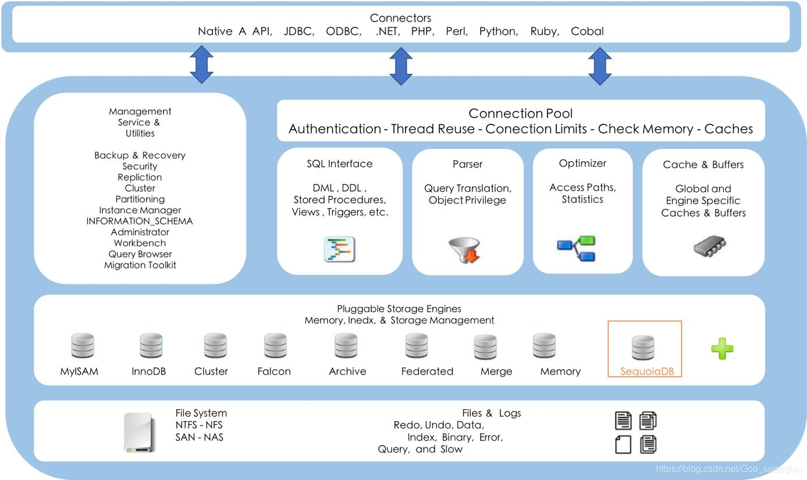
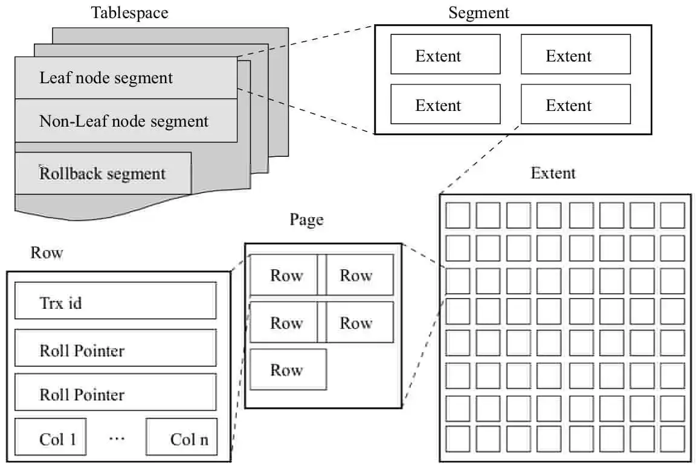

# 存储引擎

### MySQL体系结构




- **连接层**
	- 最上层是一些客户端和链接服务，主要完成一些类似于**连接处理，授权认证**，及相关的安全方案。服务器也会安全接入的每个客户端验证它所具有的操作权限。
- **服务层**
	- 第二层架构主要完成大多数的核心服务功能，如SQL接口，并完成缓存的查询，SQL的分析和优化，部分内置函数的执行。所有跨存储引擎的功能也在这一层实现，如过程、函数等。
- **引擎层**
	- 存储引擎真正的负责了MySQL中数据的存储和提取，服务器通过API和存储引擎进行通信。不同的存储引擎具有不同的功能，这样我们可以根据自己的需要，选择合适的存储引擎
- **存储层**
	- 主要是将数据存储在文件系统之上，并完成与存储引擎的交互。


### 存储引擎简介

**定义**：

存储引擎就是存储数据，建立索引，更新/查询数据等技术实现方式。存储引擎是基于表的，而不是基于库的，所以存储引擎也可被称为表类型

> **查询建表语句**==show create table account;==

- 在创建表，指定存储引擎

	- ```sql
		CREATE TABLE 表名(
		    字段1 字段类型1 [COMMENT 字段1注释],
		    字段2 字段类型2 [COMMENT 字段2注释]
		)ENGINE = INNODB [COMMENT 表注释]
		```

	- ==ENGINE==关键字用于指定存储引擎

- 查看当前数据库支持的存储引擎

	- ```MySQL
		SHOW ENGINES;	
		```


### 存储引擎特点

- **InnoDB**

	- **介绍**

		InnoDB是一种兼顾高可靠性和高性能的通用存储引擎，在MySQL5.5之后，InnoDB是默认的MySQL存储引擎。

	- **特点**

		- DML操作遵循ACID模型，支持**事务**
		- **行级锁**，提高并发访问性能
		- 支持**外键**FOREIGN KEY约束，保证数据的完整性和正确性

	- **文件**

		- xxx.ibd:xxx代表是表名，innoDB引擎的每张表都会对应这样一个表空间文件，存储该表的表结构(frm,sdi)、数据和索引
		- 参数：innodb_file_per_table

	- **逻辑结构**

		- 

- **MyISAM**

	- **介绍**

		MyISAM是MySQL早起默认存储引擎。

	- **特点**

		- 不支持事务，不支持外键
		- 支持表锁，不支持行锁
		- 访问速度快

- **Memory**

	- **介绍**

		Memory引擎的表数据时存储在内存中，由于受到硬件问题，或断电问题的影响，只能将这些表作为临时表或缓存使用。

	- **特点**

		- 内存存放
		- hash索引

	- 文件

		- xxx.sdi:存储表结构数据


## 存储引擎选择

在选择存储引擎时，应该选择应用系统的特点选择合适的存储引擎。对于复杂的应用系统，还可以根据实际情况选择多种存储引擎进行组合

- **InnoDB**：是MySQL的默认存储引擎，支持事务，外键。如果应用对事务的完整性有比较高的要求，在并发条件下要求数据的一致性，数据操作除了插入和查询之外，还包含很多的更新，删除操作，那么InnoDB存储引擎时比较合适的选择。
- **MyISAM**：如果应用是以读操作和插入操作为主，只有很少的更新和删除操作，并且对事务的完整性、并发要求不是很高，那么选择这个存储引擎是非常合适的。
- **MEMORY**：将所有数据保存在内存中，访问速度快，通常用于临时表及缓存。MEMORY的缺陷就是对表的大小有限制，太大的表无法缓存在内存中，而且无法保障数据的安全性。

