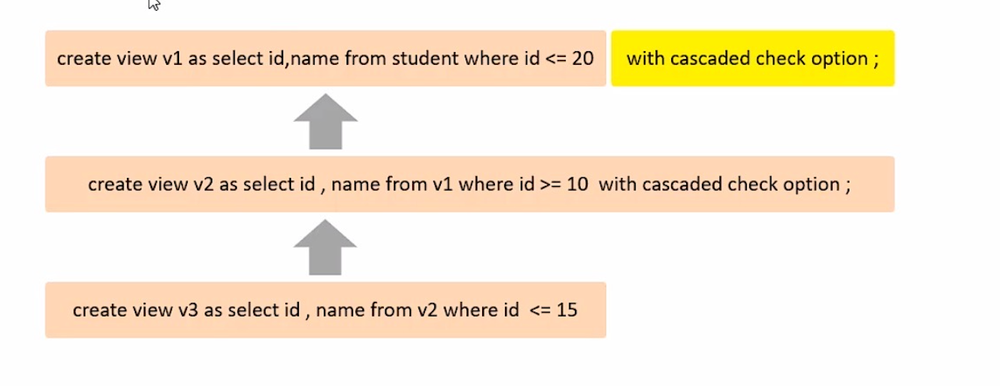

# 视图

### 介绍

视图是一种虚拟存在的表。视图中的数据并不在数据库中实际存在，行和列数据来自定义视图的查询中使用的表，并且是在使用视图时动态生成的

通俗的讲，视图只保存了查询的SQL逻辑，不保存查询结果。所以我们在创建视图的时候，主要的工作就落在创建这条SQL的查询语句上。


- **创建**

	```SQL
	CREATE [OR REPLACE] VIEW 视图名称[(列名列表)] AS SELECT语句 [WITH[CASCADED | LOCAL] CHECK OPTION]
	```

- **查询**

	```sql
	# 查看创建视图语句
	show create view 视图名称;
	# 查看视图数据
	select * from 视图名称...;
	```

- **修改**

	```sql
	# 方式1
	CREATE [OR REPLACE] VIEW 视图名称[(列名列表)] AS SELECT语句 [WITH[CASCADED | LOCAL] CHECK OPTION];
	# 方式2
	ALTER VIEW 视图名称[(列名列表)] AS SELECT语句 [with[CASCADED | LOCAL] CHECK OPTION];
	```

- 删除

	```sql
	DROP VIEW [IF EXISTS] 视图名称[,视图名称]; 
	```

	

- **视图的检查选项**

	当使用`WITH CHECK OPTION`子句创建视图时，MySQL会通过视图检查正在更改的每个行,例如 插入，更新，删除，以使其符合视图的定义。MySQL允许基于另一个视图创建视图，他会检查依赖视图中的的规则以保持一致性。为了确定检查的范围，mysql提供了两个选项：

	`CASCADED`和`LOCAL`，默认值为`CASCADED`	



### 更新及作用

**视图的更新**

要使视图更新，视图中的行于基础表的行之间必须存在一对一的关系。如果视图包含以下任何一项，则视图不可更新

- 聚合函数或窗口函数
- DISTINCT
- GROUP BY
- HAVING
- UNION 或者 UNION ALL

**视图的作用**

- 简单

	视图不仅可以简化用户对数据的理解，也可以简化他们的操作。哪些被经常使用的查询可以被定义为视图，从而使得用户不必为以后的操作每次指定全部条件。

- 安全

	数据库可以授权，但不能授权到数据库特定的行和特定列上。通过视图用户只能查询和修改他们所能见到的数据

- 数据独立

	视图可帮助用户屏蔽真实表结构变化带来的影响