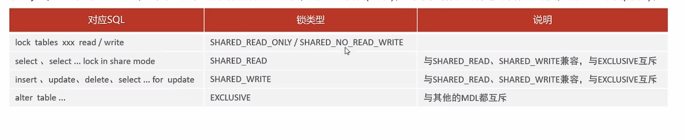

# 锁

#### 概述

锁是计算机协调多个进程或线程并发访问某一资源的机制。在数据库中，除传统的计算资源(CPU、RAM、I/O)的争用以外，数据也是一种供许多用户贡献的资源。如何保证数据并发访问的一致性，有效性是索引数据库必须解决的一个问题，锁冲突也是影响数据库并发访问性能的一个重要因素。从这个角度来说，锁对数据而言显得尤其重要，也更加复杂。

**分类**

MySQL中的锁，按照锁的粒度分，分为一下三类：

- 全局锁：锁定数据库中的所有表
- 表级锁：每次操作锁住整张表
- 行级锁：每次操作锁住对应的行数据


### 全局锁

**概述**

全局锁就是整个数据库实例加锁，加锁后整个实例就处于只读状态，后续的DML的写语句，DDL语句，已经更新操作的事务提交语句都将被阻塞。

其典型的使用场景是做全库的逻辑备份，对所有表进行锁定，从而获取一致性视图，保证数据的完整性。

**语法**

```sql
# 开启全局锁
flush tables with read lock;

# 关闭全局送
unlock tables;
```

```sql
# dump data	
mysqldump -uroot -p1234 itcast > itcast.sql
```

**特点**

数据库中加全局锁，是一个比较重的操作，存在一下问题:

- 如果在主库上备份，那么在备份期间都不能执行更新，业务基本上就得停摆
- 如果在从库上备份，那么在备份期间从库不能执行主库同步过来的二进制日志，会导致主从延迟

> 在InnoDB引擎中，我们可以在备份时加上参数 --single-transaction 参数来完成不加锁的一致性数据备份


### **表级锁**

表级锁，每次操作锁住整张表。锁定粒度大，发生锁冲突的概率最大，并发度最低。应用在MyISAM、InnoDB、BDB等存储引擎中。

对于表级锁，主要分为以下三类：

- 表锁
- 元数据锁
- 意向锁


#### 表锁

对与表锁，分为两类

- 表共享读锁
- 表独占写锁


**语法**

- 加锁：lock tables 表名...read/write
- 释放锁：unlock tables /客户端断开连接。

> 读锁不回阻塞其他客户端等读，但会阻塞写。写锁既会阻塞其他客户端的读，又回阻塞其他客户端的写。


#### 元数据锁

MDL加锁过程是系统自动控制的，无需显示使用，在访问一张表的时候会自动加上。MDL锁主要作用是维护表元数据的数据一致性，在表上有活动事务的时候，不可以对元数据进行写入操作。为了避免DML与DDL冲突，保证读写的正确性。

在MySQL5.5中引入了MDL，当对一张表进行增删改查的时候，加MDL读锁(共享)；当对表结构进行变更操作的时候，加MDL写锁



查看元数据锁

```mysql
select object_type,object_schema,object_name,lock_type,lock_duration from performance_schema.metadata_lock;
```


#### 意向锁

- 意向共享锁：与表锁共享锁兼容，与表锁排他锁互斥
- 意向排他锁：与表锁共享锁及排他锁都互斥。意向锁之间都不会互斥。

```sql
select object_schema,object_name,lock_type,lock_mode,lock_data from performance_schema.data_locks;
```


#### 行级锁

**概述**

行级锁，每次操作锁住对应的行数据。锁定粒度最小，发生锁冲突的概率最低，并发度最高。应用在InnoDB存储引擎中。


InnoDB的数据是基于索引组织的，行锁是通过对索引上的索引项加锁来实现的，而不是对记录加的锁。对于行级锁，主要分为以下三类：

- 行锁：锁定单个行记录的锁，防止其他事务对此进行update和delete。在RC、RR隔离级下都支持
- 间隙锁：锁定索引记录间隙，确保索引记录间隙不变，防止其他事务在这个间隙进行Insert,产生幻读。在RR隔离级别下都支持
- 临键锁：行锁和间隙锁组合，同时锁住数据，并锁住前面的间隙Gap。在RR隔离级别下支持。


**行锁**

InnoDB实现了以下两种类型的行锁：

- 共享锁：允许一个事务去读一行，组织其他事务获得相同的数据及的排他锁
- 排他锁：允许获取排他锁的事务更新数据，阻止其他事务获得相同数据集的共享锁和排他锁

> 默认情况下，InnoDB在RR事务隔离级别下运行，InnoDB使用next-key锁进行搜索和索引扫描，以防止幻读
>
> - 针对唯一索引进行检索时，对已存在的记录进行等值匹配，将会自动优化为行锁。
> - InnoDB的行锁是针对索引加的锁，不通过索引条件检索数据，那么InnoDB将对表中的所有记录加锁，此时会升级为表锁。


**间隙锁**

> 默认情况下，InnoDB在RR隔离级别下运行，InnoDB使用next-key锁进行搜索和索引扫描，以防止幻读。
>
> - 索引上的等值查询(唯一索引)，给不存在的记录加锁时，优化为间隙锁。
> - 索引上的等值查询(普通索引)，向右遍历时最后一个值不满足查询需求时，next-key lock退化为间隙锁
> - 索引上的范围查询(唯一索引)--会访问到不满足条件的第一个值为止

==间隙锁唯一目的是防止其他事务插入间隙。间隙锁可以共存，一个事务采用的间隙锁不会阻止另一个事务在同一间隙上采用间隙锁==